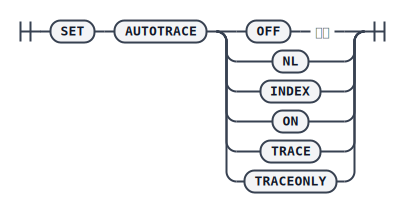

设置执行计划和统计信息的跟踪。

## 语法

## 参数

* `OFF` - 停止 `AUTOTRACE` 功能，常规执行语句；
* `NL` - 开启 `AUTOTRACE` 功能，不执行语句，如果执行计划中有嵌套循环操作，那么打印 `NEST LOOP` 相关操作符的内容；
* `INDEX/ON` - 开启 `AUTOTRACE` 功能，不执行语句，如果有表扫描，那么打印执行计划中表扫描的方式、表名和索引；
* `TRACE` - 开启 `AUTOTRACE` 功能，执行语句，打印执行计划，并展示执行过程中的部分监控信息；需要设置 INI 中监控参数 `ENABLE_MONITOR/MONITOR_SQL_EXEC/ENABLE_MONITOR_DMSQL` 均为开启才有实际意义。此功能与服务器 `EXPLAIN` `语句的区别在于，EXPLAIN` 只生成执行计划，并不会真正执行 SQL 语句，因此产生的执行计划有可能不准；而通过 TRACE 获得的执行计划，是服务器实际执行的计划（可能是重用了计划缓存中计划，也可能是新生成的计划）；
* `TRACEONLY` - 开启 `AUTOTRACE` 功能，执行语句，打印执行计划，并展示执行过程中的部分监控信息；需要设置 INI 参数 `ENABLE_MONITOR/MONITOR_SQL_EXEC/ENABLE_MONITOR_DMSQL` 均为开启才有实际意义。此功能与 `TRACE` 区别在于对于查询语句集不打印结果集；

## 监控信息项

* `data pages changed` - 更改的数据页数；
* `undo pages changed` - 更改的 `UNDO` 日志页数；
* `logical reads` - 逻辑读次数；
* `physical reads` - 物理读次数；
* `redo size` - `REDO` 日志大小；
* `bytes sent to client` - 发给客户端的数据流量；
* `bytes received from client` - 客户端接收的数据流量；
* `roundtrips to/from client` - 客户端与服务器交互次数；
* `sorts (memory)` - 最优排序次数；
* `sorts (disk)` - 单路/多路归并排序次数；
* `rows processed` - DML 操作影响的行数；
* `io wait time(ms)` - `I/O` 等待时间；
* `exec time(ms)` - 执行时间；
