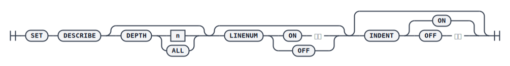

设置 `DESCRIBE` 对象结构信息的显示方式。

## 语法

## 参数

* `DEPTH` - 结构信息显示至第 N 层，默认只显示第 1 层。取值范围是 1~50；
    * 当设置为 `ALL` 时，DEPTH 为 50；
<!-- TODO 这个成员显示父亲的行号，如何理解 -->
* `LINE[NUM]` - 是否显示对象行号，成员显示父亲的行号；
* `INDENT` - 当对象的类型是复合类型时，是否通过缩进的方式显示成员信息；