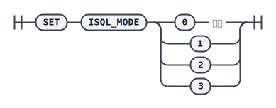

结果集打印方式。

## 语法

## 参数

* `0` - 达梦数据库的打印方式；
* `1` - 兼容 Oracle 的打印格式；
* `2` - 兼容 Greenplum 的打印格式；
<!-- TODO 说实话，没看懂 -->
* `3` - 兼容 MySQL 的打印格式，支持在一行 SQL 语句末尾将 `\G` 或`\g` 作为分号使用。其中 `\g` 和分号等价；`\G` 表示结果集按列打印，可以将每个字段打印到单独的行。若一行 SQL 语句由多个单独的查询语句组成，只能识别此行 SQL 语句末尾的 `\g` 或 `\G`，中间的 SQL 要以分号分割；且多个结果集的显示格式相同，由最后一条 SQL 语句的末尾是否使用 `\G` 决定。；
