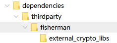

# 注意事项

## xhost 配置

如果使用 `root` 系统用户登录图形化环境，再通过 `su` 命令切换到安装系统用户进行图形化安装，可能会导致启动失败。此时需要配置 xhost，以 BASH 为例：

```bash
xhost + localhost
su - dmdba
./DMInstall.bin
```

可执行 `xclock` 命令进行测试，确认图形化时钟能够正常显示。

## 静默安装配置文件模板

静默安装通过一份 XML 配置文件描述安装参数，逐字段说明见[静默安装配置文件解析](./silent-install-config)。

## `root` 安装

使用 `root` 用户安装时需注意：

1. 安装前必须已存在 `dmdba` 系统用户。
2. 安装程序会将文件所有者设置为 `dmdba`。

不建议使用 `root` 用户安装、初始化或运行数据库及客户端工具。

## 硬件依赖

部分程序需要使用网络和存储设备。对于注册为操作系统自启动服务的数据库程序，服务启动前应确保相关硬件设备处于可用状态，否则可能导致启动失败。

## 资源限制

在 Linux（Unix）Systemd 服务环境中，通过 `ulimit` 命令或修改 `/etc/security/limits.conf` 所做的设置，对系统服务不生效。系统服务需要通过 Systemd 配置文件设置资源限制。

## 加密卡和 ukey 动态链接库

加密卡和 ukey 相关文件位于 `dmdbms\bin\dependencies\thirdparty\fisherman` 目录：

- `external_crypto_libs` 目录包含：`libenc_dll.so`、`libdmukey_v1.so`、`libdmukey_v1_server.so`
- 使用 ukey 时，还需将 `libdmukey_java.so` 拷贝到 `dmdbms\bin` 目录。
- fisherman 加密引擎文件（如 `libfmapiv100.so`、`libUSBKEYapi.so`）需由厂商提供。



## AIX 图形化安装

AIX PPC64 图形化安装依赖 GTK 2 工具包。安装前可执行 `gtk-demo` 进行测试，确认已正确安装 GTK 2。
