# 数据库配置工具使用说明

达梦数据库配置工具（DBCA）会在安装服务器组件并选择初始化数据库时自动调用，用于完成数据库初始化。本章重点介绍创建数据库实例的步骤。

## 选择操作方式

用户可选择以下四种操作之一：

- 创建数据库实例
- 删除数据库实例
- 注册数据库服务
- 删除数据库服务

选择"创建数据库实例"后，点击"开始"进入下一步。

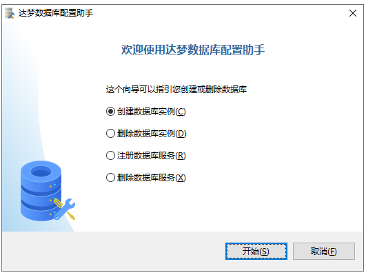

## 创建数据库模板

系统提供三套模板供选择：

- 一般用途
- 联机分析处理
- 联机事务处理

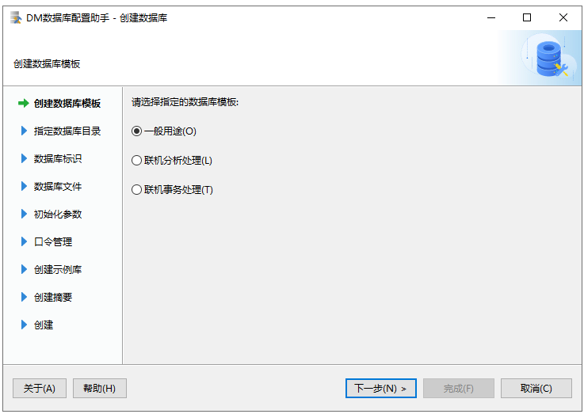

## 选择数据库目录

通过浏览或直接输入的方式，选择数据库所在目录。

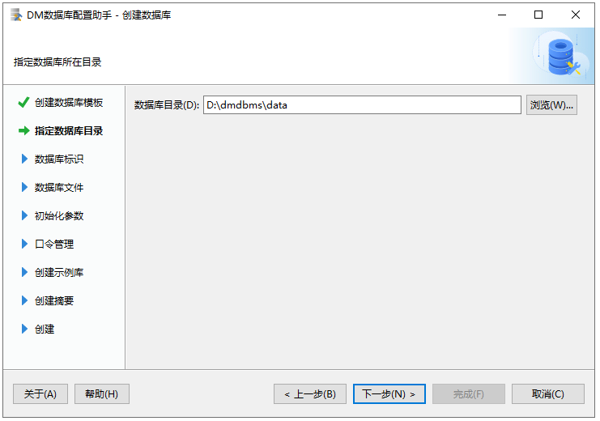

## 输入数据库标识

需要输入以下参数：

- 数据库名称
- 实例名
- 端口号

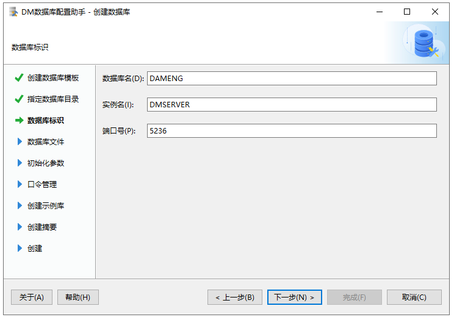

## 数据库文件所在位置

确定数据库控制文件、日志文件等的存放位置，可通过功能按钮添加或删除文件。

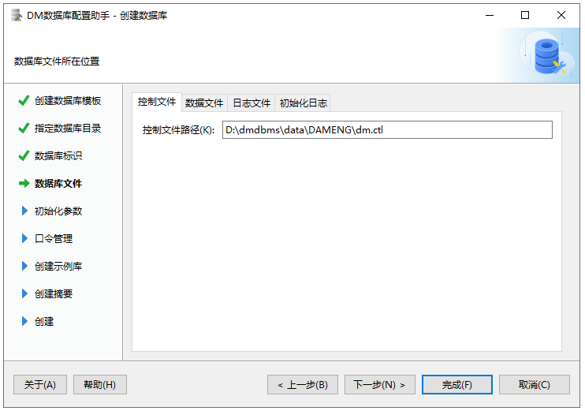

## 数据库初始化参数

需配置以下参数：

- 簇大小
- 页大小
- 日志文件大小
- 字符集选择
- 大小写敏感设置

安全版本还可以选择四权分立安全策略。

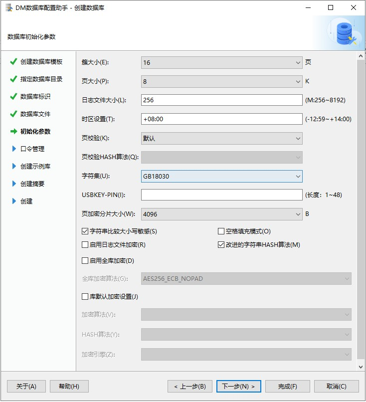

## 口令管理

需设置以下系统用户的密码：

- `SYSDBA`
- `SYSAUDITOR`
- `SYSSSO`（安全版）
- `SYSDBO`（安全版，启用四权分立时需配置）

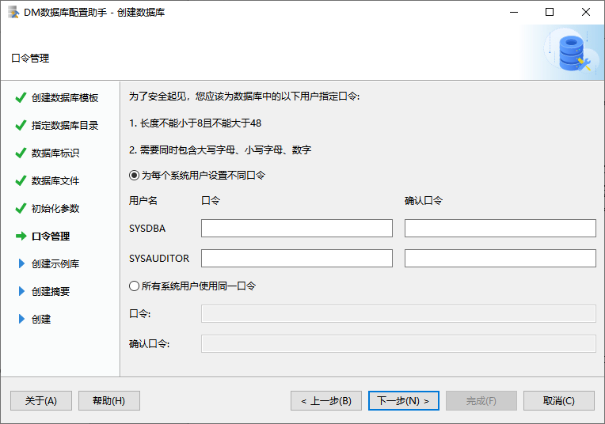

## 选择创建示例库

可选择是否创建示例库：

- `BOOKSHOP`
- `DMHR`

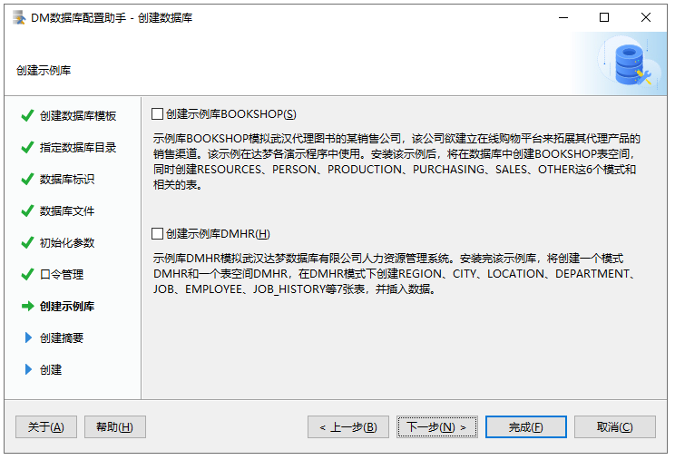

## 创建数据库摘要

显示已配置的全部参数摘要，确认无误后点击"完成"开始初始化。

在 Linux/Unix 系统下，会弹出 `ulimit` 参数提示框。

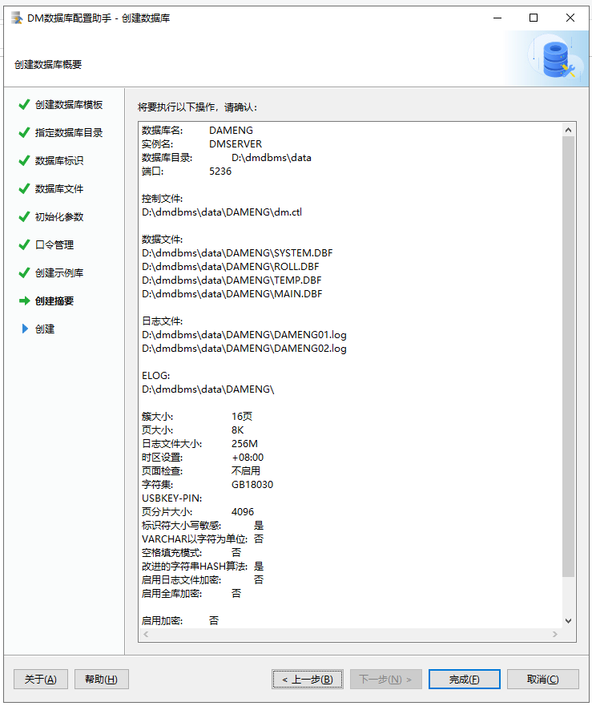

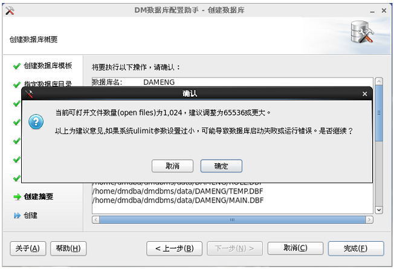

## 安装初始化数据库

显示数据库创建进度，完成后会弹出参数及文件位置信息。

点击完成后，需确认是否完成配置。

在 Linux/Unix 系统下，非 `root` 用户会收到提示，建议以 `root` 身份执行命令以创建数据库的随机启动服务。

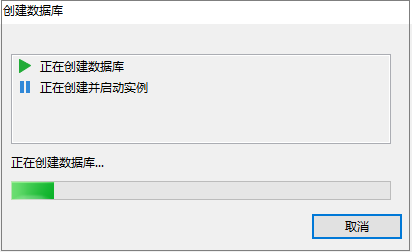

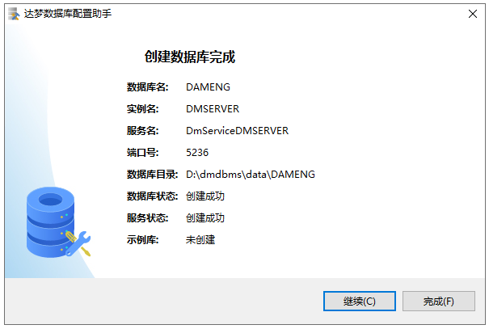

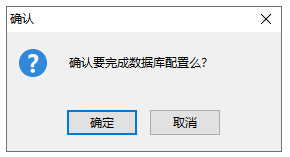

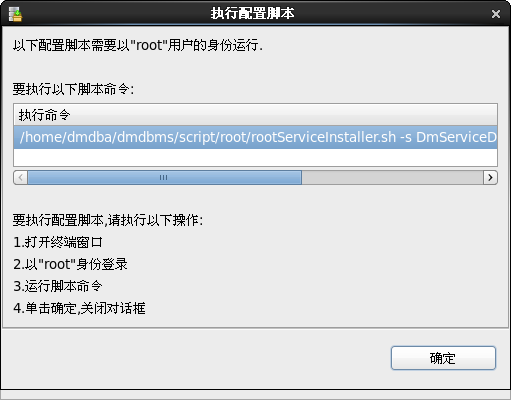
