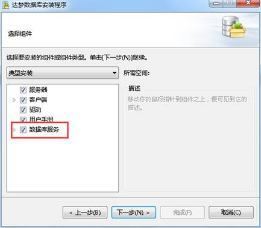

**【问题描述】**

在使用 `disql` 命令时发现数据库安装目录的 bin 目录下没有 `disql` 文件。

**【问题原因】**

该问题可能是由于安装数据库是未选择数据库服务组件，只有客户端组件，不包含相关的达梦数据库命令行工具。

**【问题解决】**

- 从已经安装的相同达梦数据库版本的服务组件的安装文件下复制 `bin` 文件夹，覆盖当前安装目录下的 `bin` 文件夹。

- 重新安装数据库，将 数据库服务 组件也写选中，如下图。

