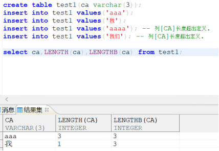
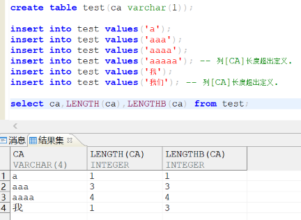
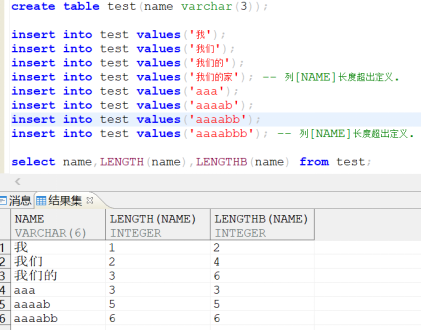
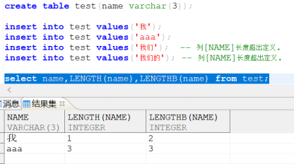

**【问题描述】**

`LENGTH_IN_CHAR` 和 `CHARSET` 组合使用效果详解。

**【问题原因】**

`LENGTH_IN_CHAR`：`VARCHAR` 类型对象的长度是否以字符为单位。取值：1、Y 表示是，0、N 表示否。默认值为 0。可选参数。1 或 Y：是，所有 `VARCHAR` 类型对象的长度以字符为单位。这种情况下，定义长度并非真正按照字符长度调整，而是将存储长度值按照理论字符长度进行放大。所以会出现实际可插入字符数超过定义长度的情况，这种情况也是允许的。同时，存储的字节长度 8188 上限仍然不变，也就是说，即使定义列长度为 8188 字符，其实际能插入的字符串占用总字节长度仍然不能超过 8188。

`CHARSET`/`UNICODE_FLAG`：字符集选项。取值：0 代表 `GB18030`，1 代表 `UTF-8`，2 代表韩文字符集 `EUC-KR`。默认为 0。

`LENGTH_IN_CHAR` 与 `CHARSET`/`UNICODE_FLAG` 参数配合时，有多种搭配结果。

以不同的字符编码的 `varchar(10)` 为例：

| 配置 | 字段长度 | 英文存储个数 | 中文存储个数 | 实际字节数 | 备注 |
| --- | --- | --- | --- | --- | --- |
| `GB18030`, `LENGTH_IN_CHAR=0` | `VARCHAR(10)` | 10 | 5 | 10 | 中文占 2 字节 |
| `GB18030`, `LENGTH_IN_CHAR=1` | `VARCHAR(10)` | 20 | 10 | 20 | 中文占 2 字节，以字符为单位，自动扩充为双倍字节数 |
| `UTF-8`, `LENGTH_IN_CHAR=0` | `VARCHAR(10)` | 10 | 3.3 | 10 | 中文占 3 字节 |
| `UTF-8`, `LENGTH_IN_CHAR=1` | `VARCHAR(10)` | 40 | 13.3 | 40 | 中文占 3 字节，以字符为单位，自动扩充为 4 倍字节数 |

以下以一实例，进行详细介绍：

- 当参数 `UNICODE_FLAG`=1、`LENGTH_IN_CHAR`=0 时。一个汉字占用三个字节，一个英文占用一个字节。例如：列定义为 `varchar(3)`，那么只能存入 1 个汉字或者 3 个英文字母。如下图：

- 当参数 `UNICODE_FLAG=1`、`LENGTH_IN_CHAR=1` 时，一个汉字占三个字节，一个英文字母占一个字节，一个字符四个字节（即一个 `varchar` 单位占四个字节），可以存四个英文字母。例如：列定义为 `varchar(1)`，那么最多只能存入一个汉字或者 4 个英文字母。如下图：

- 当参数 `UNICODE_FLAG`=0、`LENGTH_IN_CHAR`=1 时，一个汉字占两个字节一个字符，一个英文字母占一个字节，一个字符可以存一个汉字或者两个英文字母。例如：列定义为 `varchar(3)`，那么最多只能存入三个汉字或者 6 个英文字母。如下图：

- 当参数 `UNICODE_FLAG`=0、`LENGTH_IN_CHAR`=0 时，一个汉字占两个字节，一个英文字符占一个字节。一个汉字占用两个字节。例如：列定义为 `varchar(3)`，那么最多存入一个汉字或者 3 个英文字母。如下图：

**【问题解决】**

在初始化数据库前，需根据实际业务字符存储需求，结合上述对照表确定合适的 `LENGTH_IN_CHAR` 与 `CHARSET`/`UNICODE_FLAG` 参数组合，因为这两个参数在数据库创建后均不可修改。
