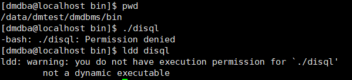
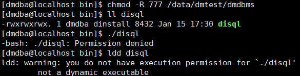
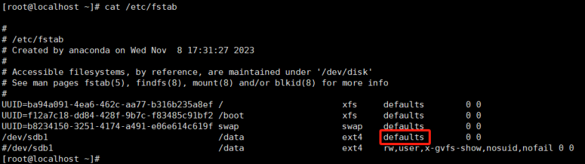
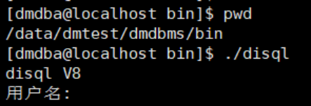

**【问题描述】**

`/data` 为挂载磁盘，在将达梦数据库软件安装到 `/data` 下后，执行 `disql`、`dimp`、`dminit`、manager 等工具时均出现报错 `-bash: ./disql: Permission denied`，且使用 Tab 键无法进行命令补全。将 `dmdbms` 目录权限修改为 777 依旧出现报错 `-bash: ./disql: Permission denied`。使用 `ldd` 查看 `disql`，出现报错 `ldd: warning: you do not have execution permission for ./disql' not a dynamic executable`。

**【问题分析】**

查看 `/etc/fstab`，发现 `/data` 目录挂载选项包含有 rw，没有执行权限 `exec`。由于是磁盘挂载选项的配置问题，所以不止是 DM 软件，如果未配置执行权限 exec，该挂载目录下所有的可执行程序都无法执行，报错权限不足或缺少某些选项，导致无法进行部分操作。

**【问题解决】**

将挂载选项修改为 default 或增加执行权限 `exec` 后，重新挂载磁盘或重启服务器，即可正常启动可执行程序。

补充说明：

文件系统为 ext4 时，default 选项包含权限 rw, suid, dev, exec, auto, nouser, async。
