**【问题描述】**

如何正确的卸载达梦数据库。

**【问题原因】**

该操作没有特定触发原因，属于安装/部署过程中的常规操作需求。卸载达梦数据库涉及停止数据库服务、删除数据库实例（或服务）以及卸载安装目录等多个步骤，操作顺序不当可能导致服务残留或卸载不完整，因此需要按规范步骤进行。

**【问题解决】**

以下介绍 Windows 环境和 Linux 环境下（命令行方式/图形化方式）卸载达梦数据库的方法。

**Windows 环境下：**

- 停止数据库服务。

打开达梦数据库服务查看器，如下图所示：

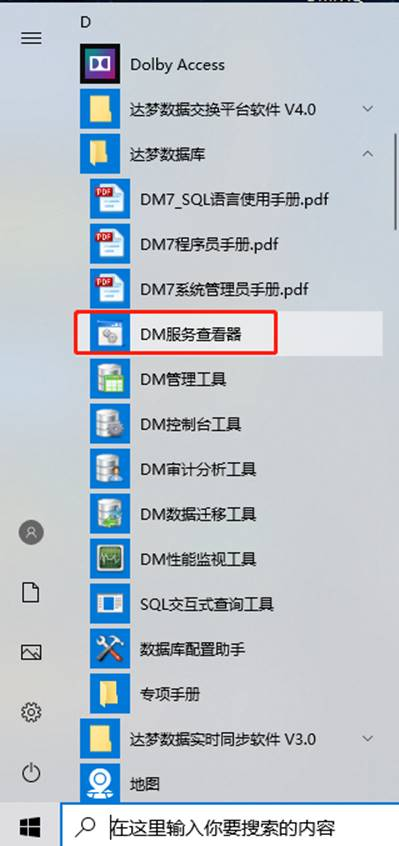

点击达梦数据库实例服务，再点击"停止"，如下图所示：

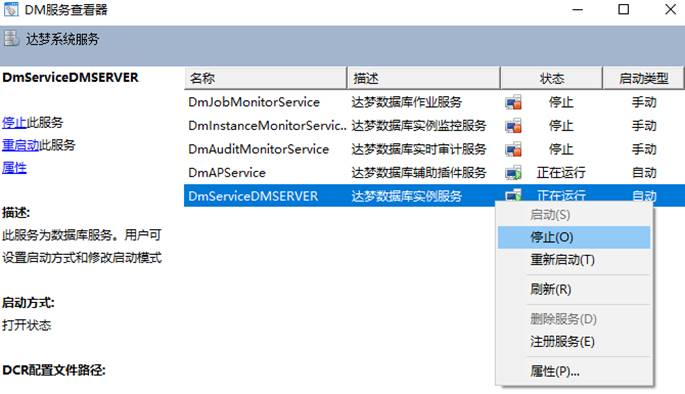

- 删除数据库实例或删除数据库服务

打开数据库配置助手，如下图所示：

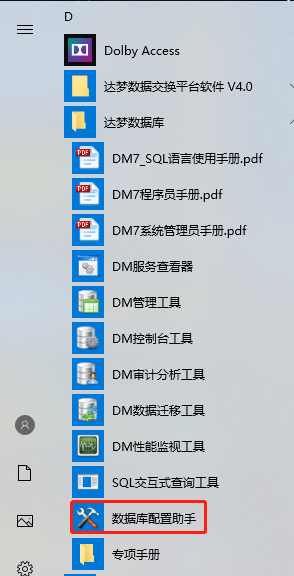

选择"删除数据库实例"或"删除数据库服务"，如下图所示：

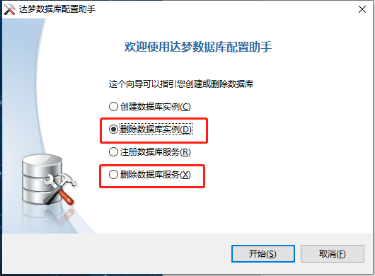

选择需要删除的数据库实例，点击"下一步"，如下图所示：

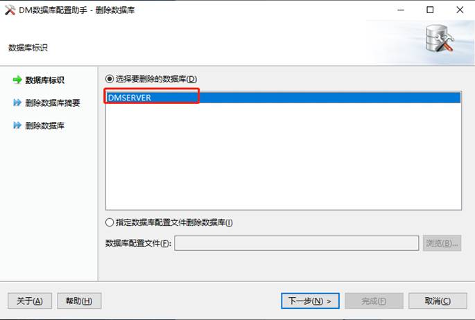

点击"完成"即可删除数据库实例，如下图所示：

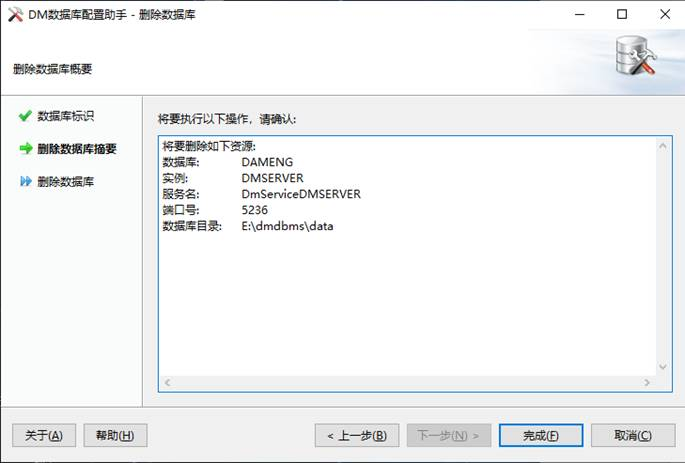

- 卸载数据库

在数据库的安装目录 `dmdbms` 文件夹中点击 `uninstall.exe` 即可完成卸载，如下图所示：

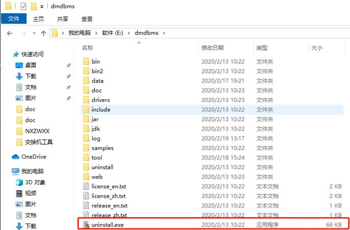

**Linux 环境命令行方式卸载达梦数据库**

- 停止数据库服务

查看数据库服务，执行如下命令查看数据库服务是否正在运行。
```
ps -ef|grep dmserver
```

如下图所示数据库服务正在运行：

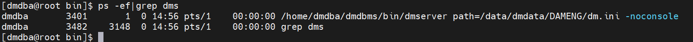

使用 `dmdba` 用户进入数据库安装目录下的 `bin` 目录执行如下命令停止数据库服务（主备请参考主备的停止服务的方法）:
```
cd /home/dmdba/dmdbms/bin/
./DmServiceDMSERVER stop
```

如下图所示：

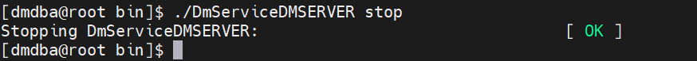

- 删除数据库实例

进入数据库安装目录 `/data/dmdata` 目录执行如下命令删除数据库实例（生产环境请慎用 `rm -rf`，以免误删除）：
```
rm  –r  DAMENG
```

如下图所示：

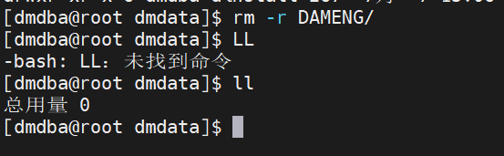

- 卸载数据库

进入数据库的安装目录下执行如下命令卸载数据库：
```
./uninstall.sh
```

如下图所示：

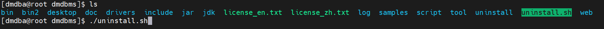

**Linux 环境使用图形化方式卸载达梦数据库**

- 停止数据库服务

进入数据库安装目录下的 `tool` 目录执行如下命令打开达梦数据库服务查看器：
```
./dmservice.sh
```

打开达梦数据库服务查看器后，右键单击达梦数据库实例服务，选择"停止"，如下图所示：

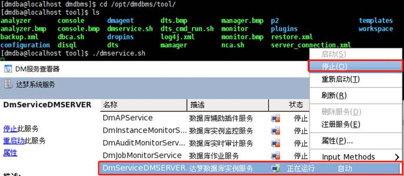

- 删除数据库实例或数据库服务

进入数据库安装目录下的 `tool` 目录执行如下命令打开达梦数据库配置助手：
```
./dbca.sh
```

打开达梦数据库配置助手后，删除数据库实例或删除数据库服务，如下图所示：

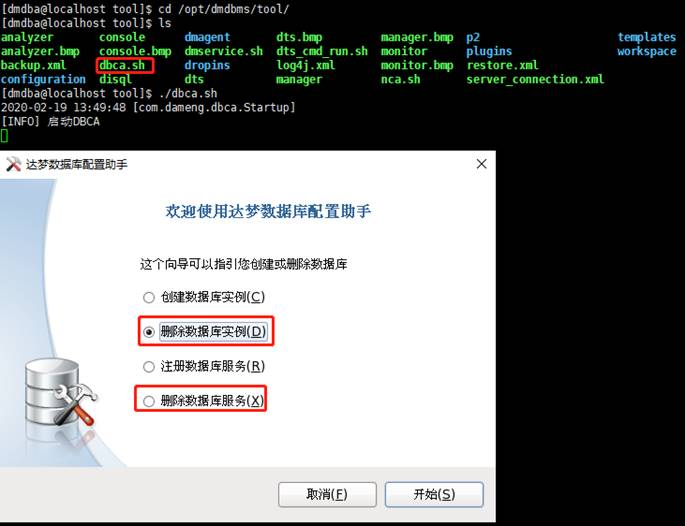

选择需要删除的数据库实例，如下图所示：

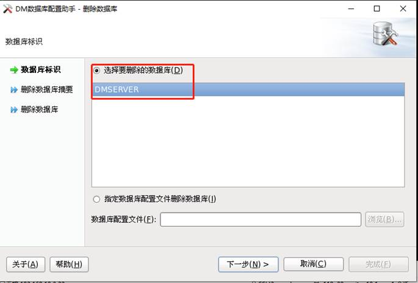

点击"完成"即可删除数据库实例，如下图所示：

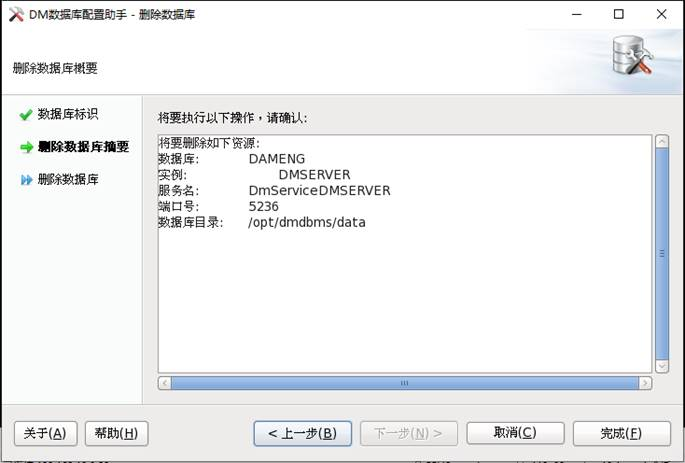

- 卸载数据库

进入数据库的安装目录下执行如下命令卸载数据库：
```
./uninstall.sh
```

如下图所示：


