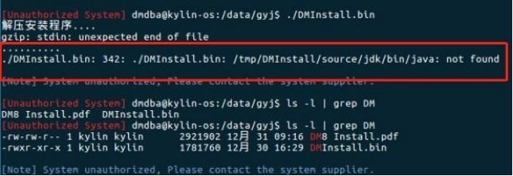

**【问题描述】**

Linux 中安装数据库报错误：`./DMInstall.bin: /tmp/DMInstall/source/jdk/bin/java:  not found`。

**【问题原因】**

该问题可能是由于数据库版本与操作系统版本不匹配或者安装包损坏导致。

**【问题解决】**

- 检查数据库安装包与操作系统版本是否匹配，如果不匹配，需要重新下载或申请对应版本的安装包重新安装。

- 如果数据库安装包与操作系统版本匹配，则可能是由于移动安装包时造成安装包损坏，重新下载或用压缩包压缩方式上传。
