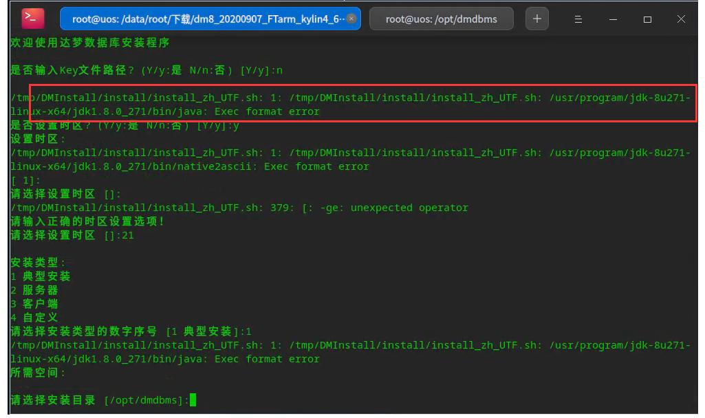

**【问题描述】**

安装数据库时报如下错误：

**【问题原因】**

该问题较大可能是由于数据库版本和操作系统版本不匹配导致，建议更换与操作系统版本相匹配的数据库安装包进行安装。

**【问题解决】**

- 检查安装的达梦数据库软件包是否和操作系统版本匹配。可以在社区内咨询，查询不同系统应该选择什么开发试用软件包。

- 检查安装的达梦数据库软件包是否和操作系统 CPU 型号相匹配。

- 换与操作系统版本相匹配的数据库安装包进行安装。
