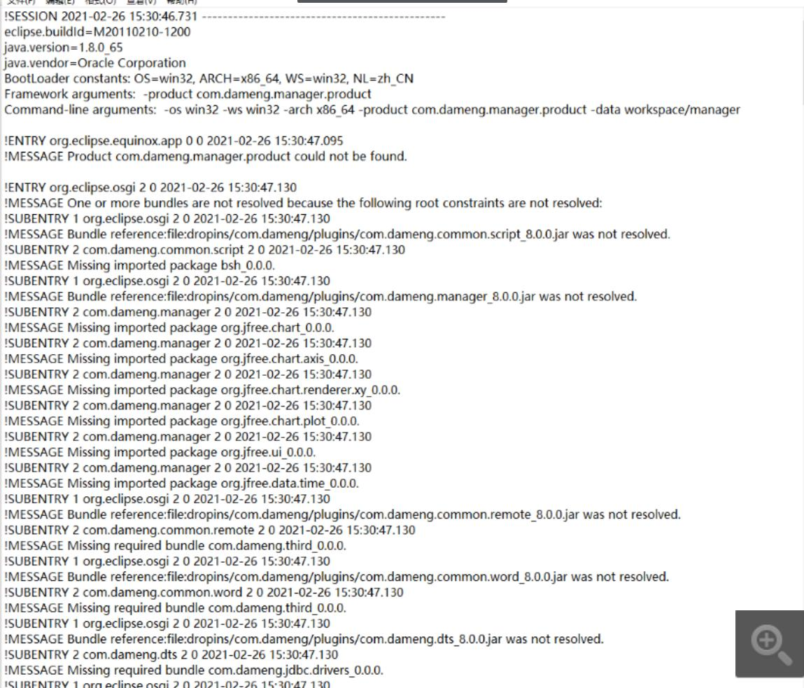

**【问题描述】**

打开管理工具时报错，日志文件出现以下错误信息：

**【问题原因】**

该报错通常与管理工具运行所依赖的 Java 环境有关，若手动指定了非达梦数据库自带的 `JDK` 环境，可能导致工具相关产品组件无法被正确加载。

**【问题解决】**

如果对安装程序和客户端运行的 Java 环境无特殊需求，可忽略设置 Java 环境。达梦数据库的安装软件自带有一个 `JDK` 环境，不建议手动指定 `JDK` 环境。
