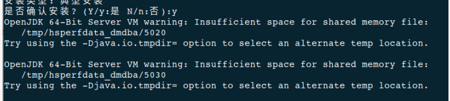

**【问题描述】**

安装数据库时报错，具体信息如下图：



**【问题解决】**

- 检查存储空间
达梦数据库完全安装需要最少 1GB 的可用内存，用户需要提前规划好安装目录，预留足够的存储空间。用户在达梦数据库安装前也应该为数据库实例预留足够的存储空间，规划好数据路径和备份路径。用户可使用以下命令检查存储空间：
```
df -h /dm8   #查询目录/dm8 可用空间
```

- 检查临时文件空间大小。
达梦数据库安装程序在安装时将产生临时文件，临时文件需要 1GB 的存储空间，临时文件目录默认为 `/tmp`。如果 `/tmp` 目录不能保证 1GB 的存储空间，用户可以扩展 `/tmp` 目录存储空间或者通过设置环境变量 `DM_INSTALL_TMPDIR` 指定安装程序的临时目录。

例如：
```
[root@localhost /]# mkdir -p /home/tmp1     #新建/home/tmp1 目录为临时文件目录
[root@localhost /]# chown -R dmdba:dinstall /home/tmp1

[dmdba@localhost ~]$ vi .bash_profile
export DM_INSTALL_TMPDIR=/home/tmp1           #配置环境变量

[dmdba@localhost ~]$ source .bash_profile     #环境变量生效
```

再重新安装达梦数据库即可。
