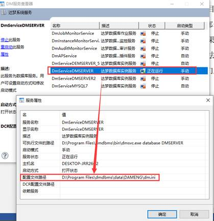
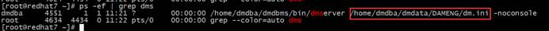
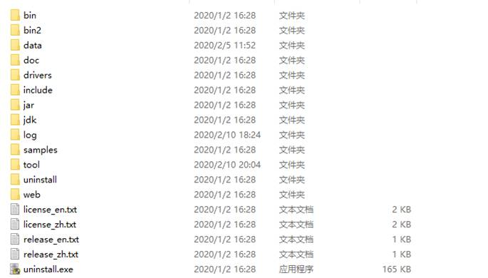

**【问题描述】**

数据文件存放路径在哪里。

**【问题原因】**

达梦数据库数据文件存放路径是根据项目要求进行存放的，没有特定路径。

**【问题解决】**

一般情况下，达梦工程师安装部署完成数据库后，会提供相应部署文档，其中包含数据库文件路径信息，如果没有部署文档，请参考以下方法。

- 方法一：咨询数据库管理和维护人员。

- 方法二：如果是 Windows 或有图形化界面的 Linux，可以尝试通过"达梦数据库服务查看器"工具，找到 `DmService` 开头的服务，鼠标右键选择"属性"，"服务属性"中"配置文件路径"一项的路径即为数据文件路径。



> [!note]
> 如果在"达梦数据库服务查看器"中找不到相应的服务，可能服务没有注册或通过其他方式启动数据库，此时请参考后面方法查找数据文件路径。

- 方法三：无论 Window 还是 Linux 系统，均可在系统中搜索 `MAIN.DBF` 文件，以最新的文件为准，该文件所在的目录为数据库文件所在路径。

- 方法四：Linux 系统，通过执行 `ps -ef | grep dmserver` 命令查看进程的方式找到相应的路径。



- 方法五：通过查看 `v$datafile` 数据字典的 `path` 字段，可以得到数据文件的具体存放路径。


```txt
达梦数据库目录说明

dmdbms 目录：数据库安装目录。
bin 目录：数据库核心文件目录。
data 目录：数据库实例文件存放目录。
doc 目录：数据库手册（安装手册，系统管理员手册，SQL 语言使用手册等）存放目录。
drivers 目录：数据库驱动存放目录。
log 目录：数据库日志文件存放目录。
samples 目录：配置文件样板（dmarch 归档文件，dmmal 通信文件等）存放目录。
tool 目录：数据库工具（管理工具，数据迁移工具，审计与分析工具等）存放目录。
web 目录：web 工具 (DEM) 的连接及配置手册存放目录。
license_en：英文《软件产品授权证书》概述。
license_zh：中文《软件产品授权证书》概述。
release_en：英文达梦数据库管理系统版本号汇总。
release_zn：中文达梦数据库管理系统版本号汇总。
uninstall.exe：数据库卸载，双击即可按照提示进行数据库的卸载。
```


