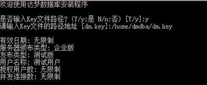
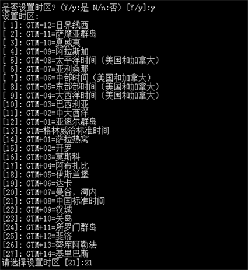
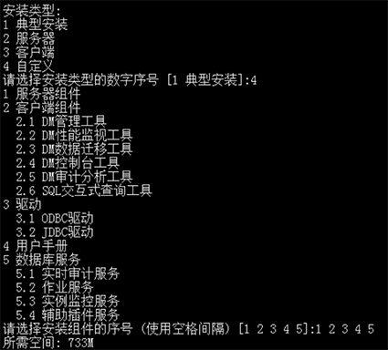
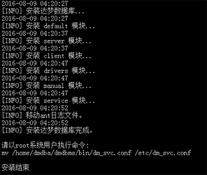

**【问题描述】**

执行 ./`DMInstall.bin` 或初始化实例时，启动图形化界面报以下错误：
```
Exception in thread "main" java.lang.unsatisfiedLinkError: could not load SWT library.
Reasons:no swt…....No such file or directory
```

无法打开图形化界面时如何安装数据库和初始化实例？

**【问题解决】**

针对以上报错，存在两种情境，以下提供这两种情境下的解决办法。

情景一：安装达梦数据库时，针对无法启动图形化的服务器，达梦数据库提供纯文本安装方式。具体安装过程如下：

- 执行安装文件选择安装语言
```
[dmdba@RS219 test]$ ./DMInstall.bin -i
```


如果当前操作系统中已存在达梦数据库，终端会弹出提示，输入选项【y】，将进行下一步的命令行安装，否则退出命令行安装。如下图所示：


- 验证 Key 文件

用户可以选择是否输入 Key 文件路径。不输入则进入下一步安装，输入 Key 文件路径，安装程序将显示 Key 文件的详细信息，如果是合法的 Key 文件且在有效期内，用户可以继续安装。如下图所示：



- 输入时区

用户可以选择达梦数据库的【时区信息】。如下图所示：



- 选择安装类型

命令行安装与图形化安装的选择的【安装类型】一样。如下图所示：



用户选择安装类型需要手动输入，默认是【典型安装】。

如果用户选择【自定义安装】，将打印全部安装组件信息。用户通过命令行窗口输入要安装的组件序号，选择多个安装组件时需要使用空格进行间隔。输入完需要安装的组件序号后回车，将打印安装选择组件所需要的存储空间大小。

- 选择安装路径

用户可以输入达梦数据库的安装路径，不输入则使用默认路径，默认值为 `$HOME/dmdbms`（如果安装用户为 `root`，则默认安装目录为 `/opt/dmdbms`，但**不建议**使用 `root` 用户来安装达梦数据库）。如下图所示：


安装程序将打印当前安装路径的可用空间，如果空间不足，用户需重新选择安装路径。如果当前安装路径可用空间足够，用户需进行确认。不确认，则重新选择安装路径，确认，则进入下一步骤。

- 安装小结

安装程序将打印用户之前输入的部分安装信息。如下图所示：用户对安装信息进行确认。不确认，则退出安装程序，确认，进行达梦数据库安装。


- 安装



**注意**
安装完成后，终端提示 `请以 root 用户执行命令`。由于使用非 `root` 用户进行安装，所以部分安装步骤没有相应的系统权限，需要用户手动执行相关命令，用户可根据提示完成相关操作。

- `root` 用户执行 `root_installer.sh` 脚本，数据库安装即可完成

使用 `root` 用户，执行命令：`/home/dmdba/script/root/root_installer.sh`，显示内容如下：
```
移动 /home/dmdba/bin/dm_svc.conf 到/etc目录
修改服务器权限
创建 DmAPService 服务
创建服务 (DmAPService) 完成
启动 DmAPService 服务
```

情境二：初始化实例时，针对无法启动图形化的服务器，达梦数据库提供了 `dminit` 命令行初始化实例。**用户在数据库初始化实例时，需设置数据库系统用户的密码，并保证密码强度，以保障数据安全性**。

具体方法如下：
系统管理员可以利用该工具提供的各种参数，设置数据库存放路径、段页大小、是否对大小写敏感以及是否使用 unicode，创建出满足用户需要的初始数据库。该工具位于数据库安装路径的 bin 目录下，举例如下：
```
[dmdba@ ~]#  cd /opt/dmdbms/bin
[dmdba@ ~]#  ./dminit path=/opt/dmdbms/data  SYSDBA_PWD=****** SYSAUDITOR_PWD=******
```

**注意**
`dminit` 工具的详细介绍及使用办法请详细参考《 DM8_`dminit` 使用手册》，该手册位于数据库安装目录下的 doc 文件夹中。
