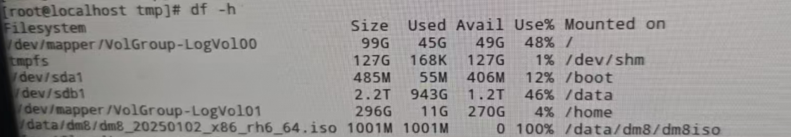
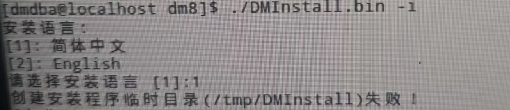
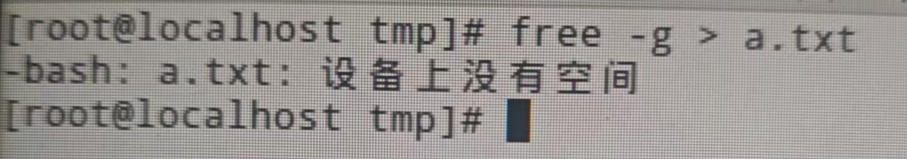
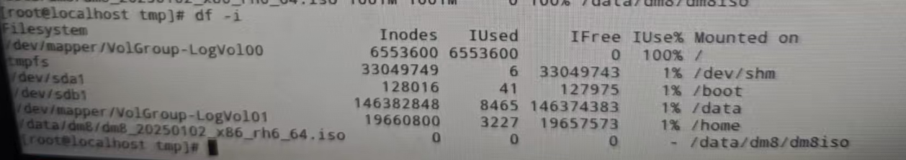
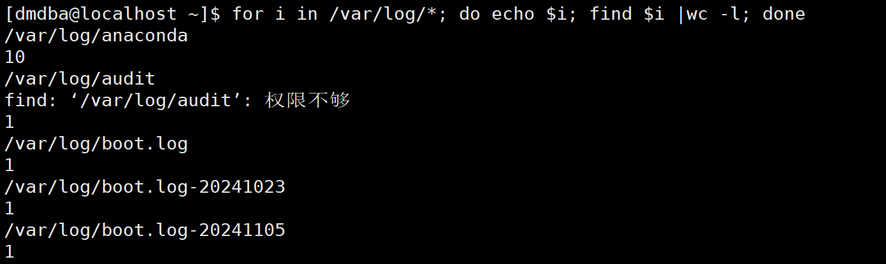

**【问题描述】**

安装软件时通过 `df -h` 命令查看服务器磁盘空间充足，但是安装软件时报错，提示`创建安装程序临时目录（/tmp/DMInstall）失败`。





在 `/` 目录下创建文件报错 `设备上没有空间`。



**【问题原因】**

Linux 系统 inode 号数量有上限，由于每个文件都必须有一个 inode，因此有可能发生 inode 已经用光，但是硬盘还未存满的情况，这时就无法在硬盘上创建新文件了。通过 `df -i` 进行查看服务器各个目录下 inode 号占用情况，可以看到/目录下 inode 占用量达到 100%。



**【问题解决】**

通过已下命令进行查看各个目录下 inode 占用个数，删除占用过多且无用的大量文件后可正常安装部署。
```
for i in /var/log/*; do echo $i; find $i |wc -l; done
```


