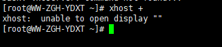
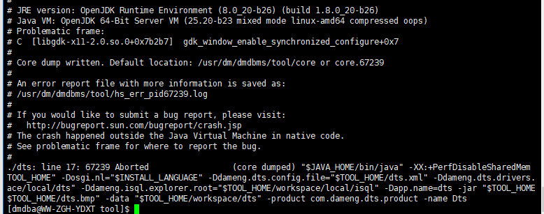

**【问题描述】**

Linux_x86（最小化安装）环境下安装 DM8，利用 xshell 远程连接服务器，`tool` 工具下打开 `./dts` 报错：无法打开工具图形界面、无法开启图形回显。如下图所示：





**【问题原因】**

该报错通常是由于 SSH 服务未开启 X11 图形转发功能（X11Forwarding），导致远程连接会话无法转发图形界面显示，从而使图形化工具无法正常打开。

**【问题解决】**

按照如下步骤修改 `sshd_config` 配置文件内容：
```
vim /etc/ssh/sshd_config  -添加如下内容

X11Forwarding yes
X11UseLocalhost no    #禁止将 X11 转发请求绑定到本地回环地址上
AddressFamily inet    #强制使用 IPv4 通道

systemctl restart sshd.service
```

修改完成后，再次打开成功。
