# Linux（Unix）下达梦数据库的安装

本节中提到的 Linux（Unix）包括 Linux、AIX、HP-UNIX、Solaris 和 FreeBSD 操作系统，具体步骤和操作请以本机系统为准。

> [!note]
> 多数 Linux（Unix）服务器没有图形化环境，且命令行安装不依赖图形界面、更适合批量部署，推荐优先使用命令行安装。

## 安装前准备工作

### 检查系统信息

如果安装包经过数字签名，可执行以下步骤验证：

```bash
gpg --import dm-pub-key
gpg --edit-key 武汉达梦数据库股份有限公司 trust
gpg --verify dm.sign dm8_setup_xxx.iso
```

第三步输出"完好的签名"（Good Signature）即表示安装包文件完好无损。

安装前需确认操作系统与安装程序是否匹配，可使用以下命令查询系统信息：

```bash
getconf LONG_BIT  # 获取系统位数
lsb_release -a    # 查询操作系统 release 信息
cat /etc/issue    # 查询系统信息
uname -a          # 查询系统名称
```

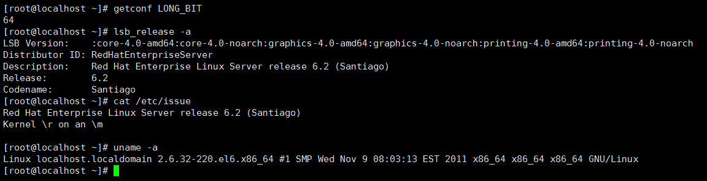

### 创建安装用户

为减少对操作系统的影响，不建议使用 `root` 用户安装和运行达梦数据库，建议提前创建专用系统用户：

```bash
groupadd -g 12349 dinstall
useradd -u 12345 -g dinstall -m -d /home/dmdba -s /bin/bash dmdba
passwd dmdba
```

> 创建安装用户后，后续操作默认使用该用户进行。

### 检查操作系统限制

Linux（Unix）系统的 `ulimit` 命令会限制程序可使用的系统资源，建议安装前检查当前用户的 ulimit 参数：

```bash
ulimit -a
```

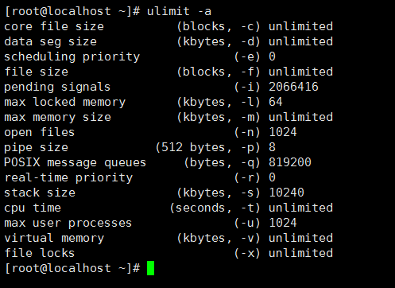

建议设置如下：

| 参数 | 建议值 | 说明 |
| --- | --- | --- |
| data seg size | 1048576KB（1GB）以上或 unlimited | 过小将导致数据库启动失败 |
| file size | unlimited | 过小将导致数据库安装或初始化失败 |
| open files | 65536 以上或 unlimited | — |
| virtual memory | 1048576KB（1GB）以上或 unlimited | 过小将导致数据库启动失败 |

以上参数可在 `/etc/security/limits.conf` 中修改。

### 检查系统内存与存储空间

- **内存**：至少需要 1GB 可用内存，可用以下命令检查。
- **存储空间**：安装需要 1GB，临时文件需要 2GB。

```bash
grep MemTotal /proc/meminfo      # 获取内存总大小
grep SwapTotal /proc/meminfo     # 获取交换分区大小
free                              # 获取内存使用详情
```

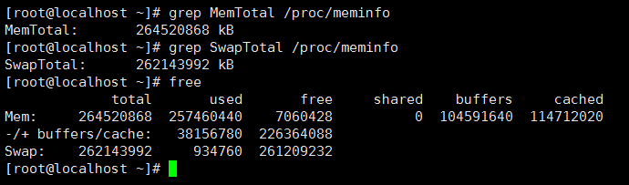

```bash
df -h /mount_point/dir_name       # 查询目录可用空间
```

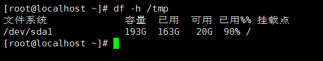

若 `/tmp` 空间不足 1GB，可扩展该目录空间，或设置环境变量指定临时目录：

```bash
mkdir -p /mount_point/dir_name
DM_INSTALL_TMPDIR=/mount_point/dir_name
export DM_INSTALL_TMPDIR
```

### 设置 Java 环境

若对安装与客户端运行的 Java 环境无特殊需求，可跳过此步骤；否则可设置环境变量指定 Java 目录：

```bash
DM_JAVA_HOME=/mount_point/jdk_home_dir
export DM_JAVA_HOME
```

## 命令行安装

许多 Linux（Unix）系统没有图形化界面，推荐使用命令行方式安装。在安装程序所在目录执行：

```bash
./DMInstall.bin -i
```

### 选择安装语言

根据提示输入对应选项并回车进入下一步。


选择语言后会解压安装程序，并对 `GLIBC_VERSION` 和硬件架构进行校验，同时打印 `ulimit` 参数信息与建议。

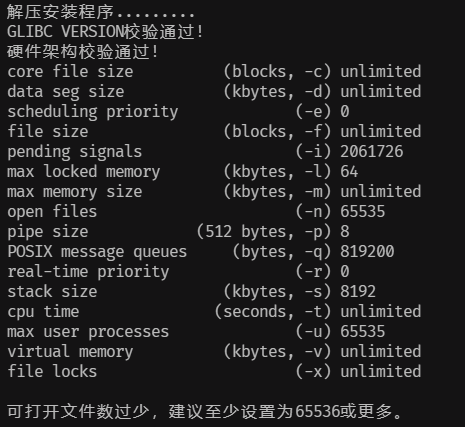

如果系统中已存在达梦数据库，会在终端提示是否继续；选择继续则进入下一步，否则退出安装。


> 若系统中已安装达梦数据库，重新安装前应完全卸载原有版本，并提前备份数据。

### 验证 Key 文件

可选择是否输入 Key 文件路径：不输入则跳过此步骤；输入后程序会显示 Key 文件详情，验证通过后可继续安装。

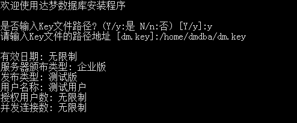

### 输入时区

选择达梦数据库使用的时区信息。

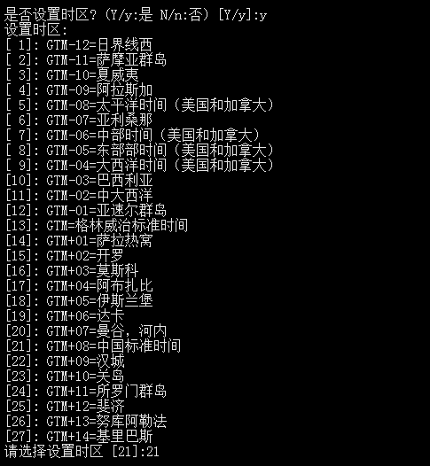

### 选择安装类型

安装类型与图形化安装一致，默认为典型安装；选择自定义安装时需通过组件序号（多个用空格分隔）指定要安装的组件。

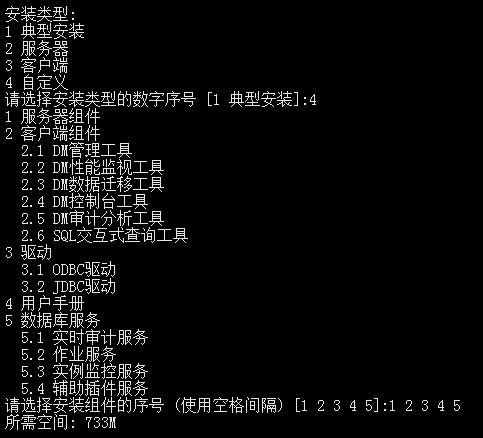

### 选择安装路径

可输入安装路径，不输入则使用默认路径 `$HOME/dmdbms`（`root` 用户默认为 `/opt/dmdbms`，不建议使用 `root` 安装）。

> 安装路径只允许使用小写字母（a-z）、大写字母（A-Z）、数字（0-9）、下划线（_）、空格和中文。

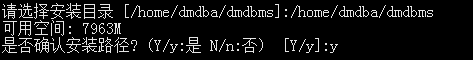

安装程序会打印当前路径的可用空间，空间不足需重新选择路径，空间足够则需要确认后才能进入下一步。

### 安装小结

打印此前输入的安装信息，确认后才能继续安装。


### 安装

显示安装过程。

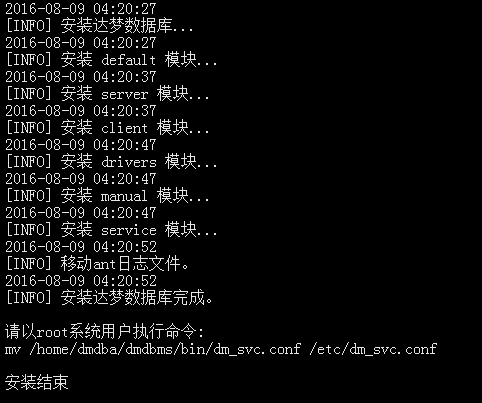

> 使用非 `root` 用户安装时，安装完成后终端会提示"请以 `root` 系统用户执行命令"，需手动执行相关命令。

### 初始化数据库与注册服务

安装结束后，还需初始化数据库并注册相关服务才能正式运行，具体可参考《DM8_dminit 使用手册》和《DM8_Linux 服务脚本使用手册》。

> 达梦数据库提供的各项服务依赖网络和存储才能正常启动，若网络或存储未就绪可能导致启动失败，可等待就绪后重新启动相关服务，或调整服务脚本中的优先级与依赖关系。

## 图形化安装

建议使用安装用户直接登录（不建议使用 `root` 用户）进行以下操作。

加载光驱并赋予安装程序执行权限：

```bash
mount /dev/cdrom /mnt/cdrom
chmod 755 ./DMInstall.bin
```

双击 `DMInstall.bin` 或执行以下命令运行图形化安装：

```bash
./DMInstall.bin
```

> [!note]
> - 图形化安装需要在图形化环境中运行，否则会报错，此时建议使用命令行安装。
> - 建议直接登录安装用户；若使用 `su` 切换到安装用户，可能导致图形化安装启动失败，详见[5.1 xhost 配置](./dm8-appendix)。
> - 安装过程中会在命令行打印 `GLIBC_VERSION` 与硬件架构的校验结果。

### 提示对话框

如果系统中已存在达梦数据库，会弹出提示对话框。

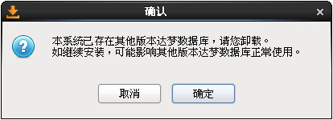

> 若系统中已安装达梦数据库，重新安装前应完全卸载原有版本，并提前备份数据。

### 选择语言和时区

根据系统配置选择相应语言与时区，点击"确定"继续安装。

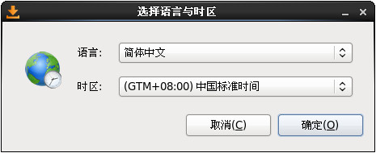

### 欢迎页面

点击"开始"按钮继续安装。

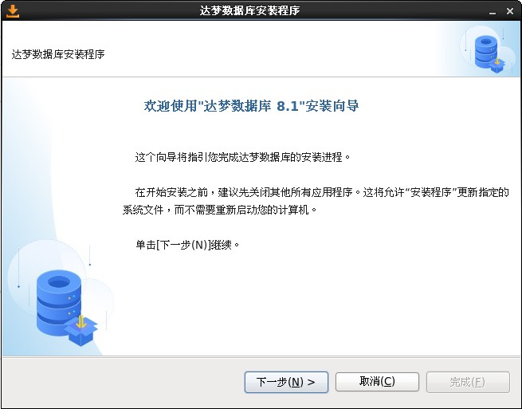

### 许可证协议

阅读并选中"接受"许可协议条款才能继续安装。

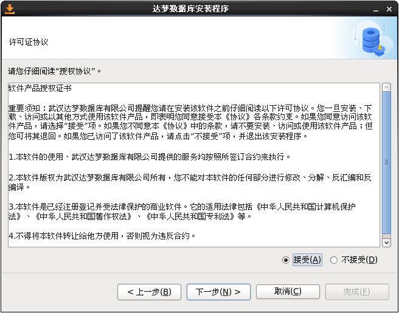

### 查看版本信息

可查看达梦数据库服务器、客户端等各组件的版本信息。

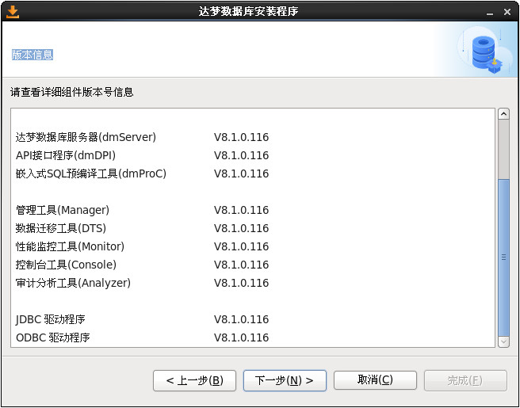

### 验证 Key 文件

点击"浏览"选取 Key 文件，验证通过后可点击"下一步"继续。

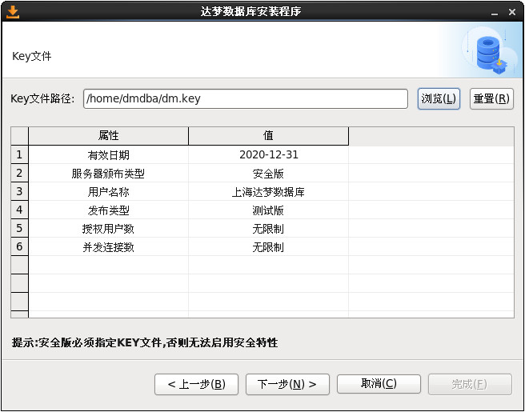

### 选择安装方式

安装方式与 Windows 一致，提供"典型安装""服务器安装""客户端安装""自定义安装"四种选择。

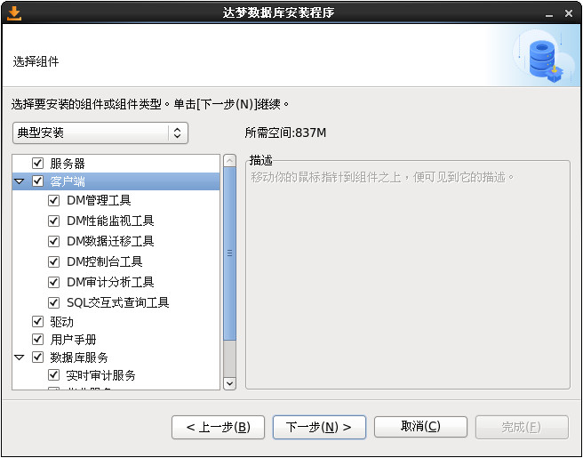

### 选择安装目录

达梦数据库默认安装目录为 `$HOME/dmdbms`（若以 `root` 用户安装，默认目录为 `/opt/dmdbms`，但不建议使用 `root` 安装）。

> 安装路径只允许使用小写字母（a-z）、大写字母（A-Z）、数字（0-9）、下划线（_）、空格和中文。

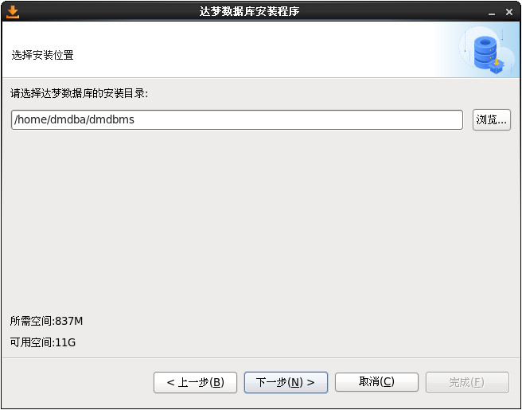

若目录已存在，会弹出警告，确认后将覆盖该路径下已有的达梦数据库组件。

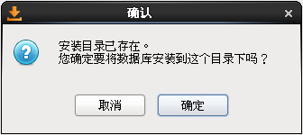

### 安装前小结

显示产品名称、版本信息、安装类型、安装目录等信息，确认无误后点击"安装"开始拷贝文件。

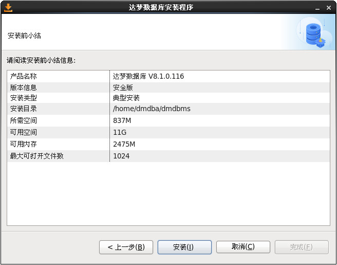

### 安装

显示安装过程。

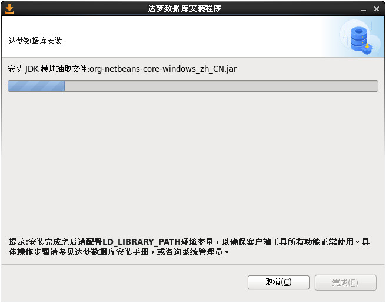

> 安装完成时会弹出对话框，提示使用 `root` 用户执行相关命令，完成后可关闭对话框并点击"完成"结束安装。

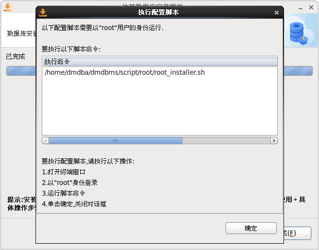

### 初始化数据库

若选中了服务器组件，安装结束时会提示是否初始化数据库。

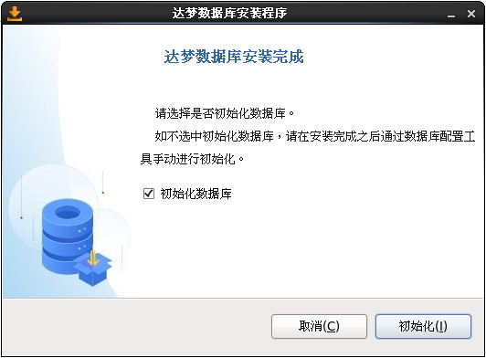

选中创建数据库后，点击"初始化"将弹出数据库配置工具，详细步骤参见[数据库配置工具使用说明](./dm8-tools)。

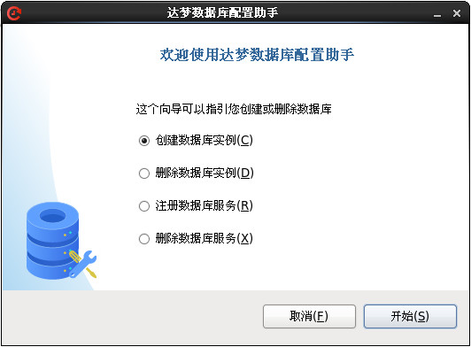

## 静默安装

在安装程序所在目录执行：

```bash
./DMInstall.bin -q 配置文件全路径
```

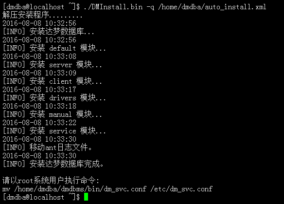

配置文件逐字段说明见[静默安装配置文件解析](./silent-install-config)。
