# Windows 下达梦数据库的安装

达梦数据库在各操作系统下的数据库服务器版本内核相同，本章介绍达梦数据库在 Windows 操作系统下的安装过程。

> [!note]
> 安装达梦数据库程序后，默认会附带一个许可证。如需更多授权，请向达梦公司申请或购买。

## 安装前准备工作

### 检查系统信息

安装前需确认操作系统与安装程序是否匹配，可在终端执行 `systeminfo` 命令查询系统信息。

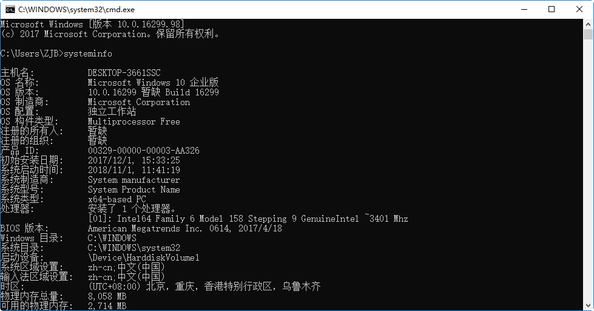

### 检查系统内存与存储空间

- **内存**：至少需要 1GB 可用内存（RAM），内存过少可能导致安装或启动失败，可通过"任务管理器"查看可用内存。
- **存储空间**：完整安装需要 1GB 存储空间，建议提前规划安装目录，并为数据库实例预留足够的存储空间。

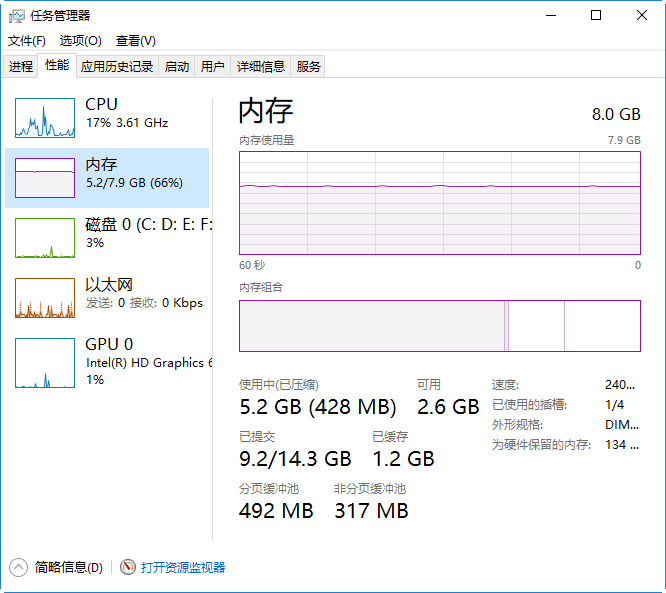

Windows 环境下提供两种安装方式：具有交互界面的图形化安装，以及非交互式的静默安装。

## 图形化安装

### 运行安装程序

将安装光盘放入光驱，或直接双击 `setup.exe`。如果系统中已存在其他版本的达梦数据库，会弹出提示对话框；点击"确定"继续安装，点击"取消"则退出安装。

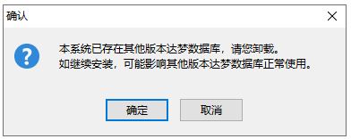

### 语言与时区选择

根据系统配置选择相应的语言与时区，点击"确定"按钮继续安装。

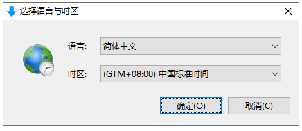

### 欢迎页面

点击"开始"按钮继续安装。

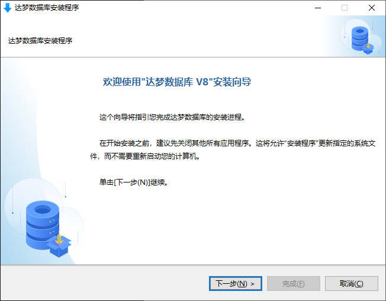

### 许可证协议

阅读许可协议条款，选中"接受"并点击"下一步"才能继续安装；若选中"不接受"，将无法安装。

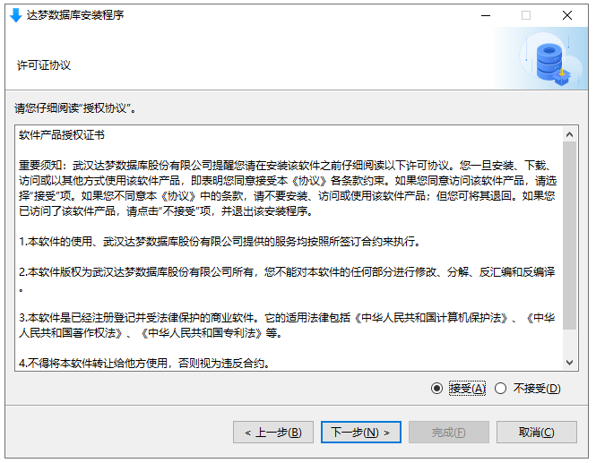

### 验证 Key 文件

点击"浏览"选取 Key 文件，安装程序会自动验证其合法性与有效期，验证通过后可点击"下一步"继续。

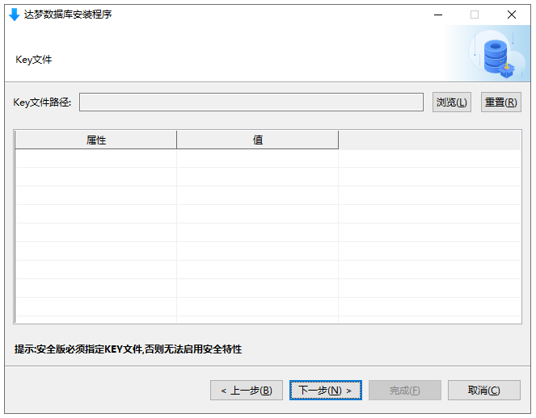

### 选择安装组件

达梦数据库提供四种安装方式：

- **典型安装**：服务器、客户端、驱动、用户手册、数据库服务
- **服务器安装**：服务器、驱动、用户手册、数据库服务
- **客户端安装**：客户端、驱动、用户手册
- **自定义安装**：按需勾选以上任意组合

一般情况下，作为服务器使用的机器只需选择"服务器安装"；若该机器同时也作为客户机使用，则需另外安装客户端组件。

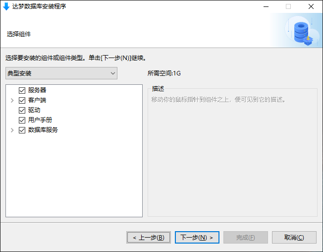

### 选择安装目录

达梦数据库默认安装在 `%HOMEDRIVE%\dmdbms` 目录下，可点击"浏览"自定义安装目录。

> 安装路径只允许使用小写字母（a-z）、大写字母（A-Z）、数字（0-9）、下划线（_）、空格和中文。

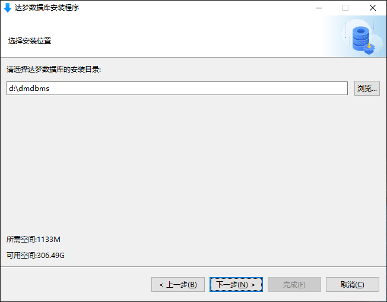

如果指定目录已存在，会弹出警告提示该路径已存在。点击"确定"将覆盖该路径下已有的达梦数据库组件；点击"取消"则返回上一步重新选择目录。

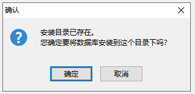

### 安装前小结

显示产品名称、版本信息、安装类型、安装目录、可用空间、可用内存等信息，确认无误后点击"安装"按钮。

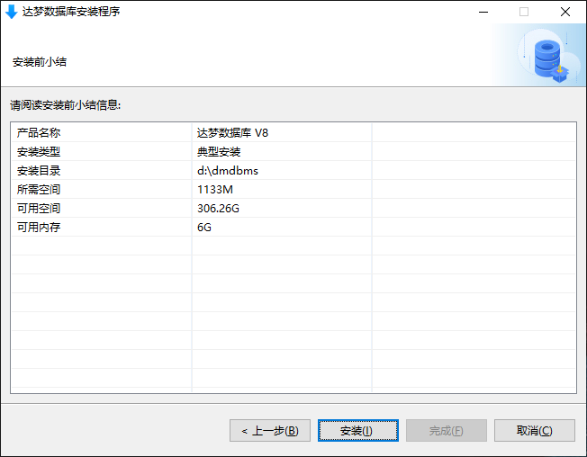

如果 `C:\Windows\system32` 目录下已存在配置文件 `dm_svc.conf`，会弹出提示框：点击"是"将生成新配置文件覆盖原文件；点击"否"则保留原文件；点击"取消"返回上一步。

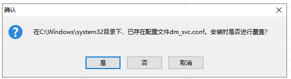

### 安装过程

显示安装进度。

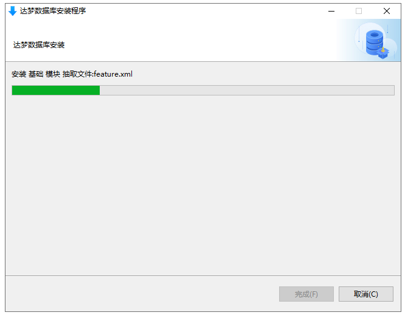

### 初始化数据库

如果安装组件中选中了服务器组件，安装结束时会提示是否初始化数据库。若未安装服务器组件，点击"完成"将直接退出。

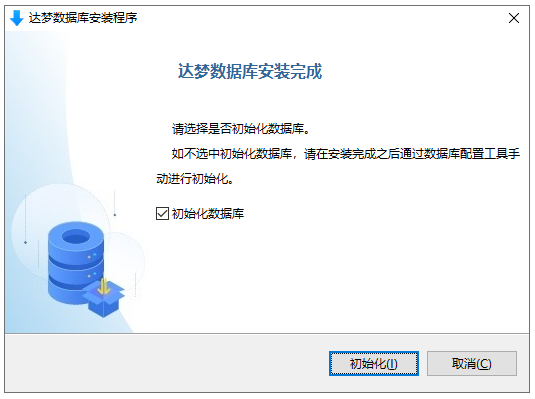

若选中初始化数据库选项，点击"初始化"会弹出数据库配置工具（DBCA），详细步骤参见[数据库配置工具使用说明](./dm8-tools)。


## 静默安装

某些场景下需要非交互式安装，可通过配置文件进行静默安装，该方式需要管理员权限。在终端进入安装程序所在目录，执行：

```
setup.bat -q 配置文件全路径
```

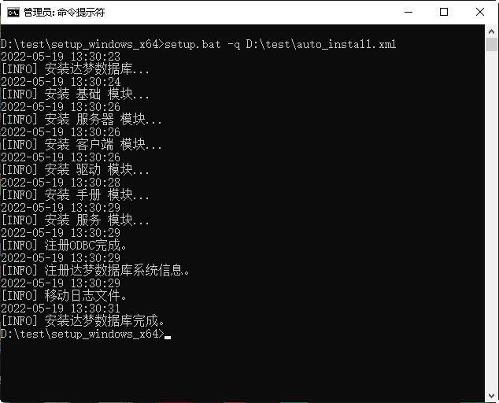

配置文件逐字段说明见[静默安装配置文件解析](./silent-install-config)。
