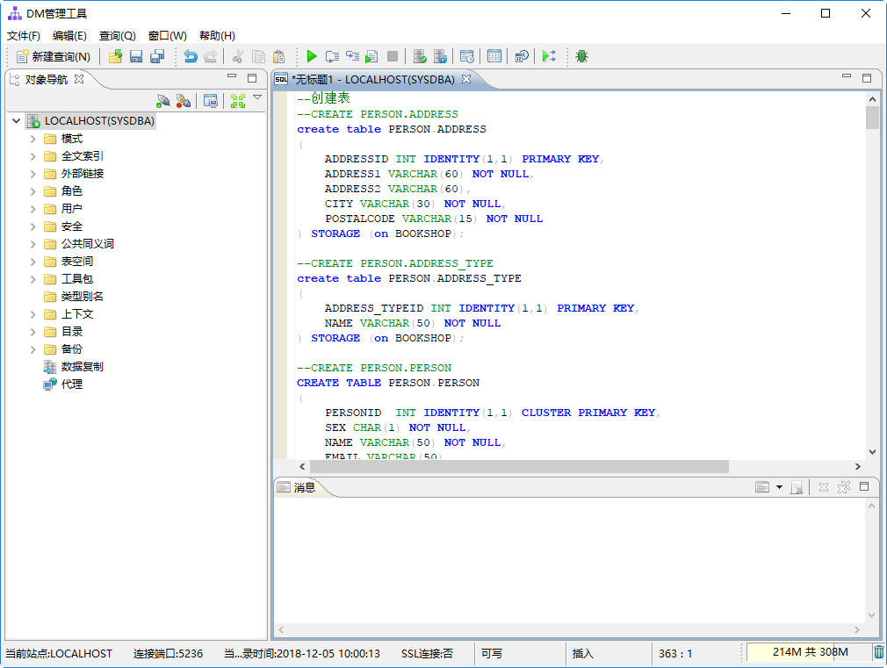
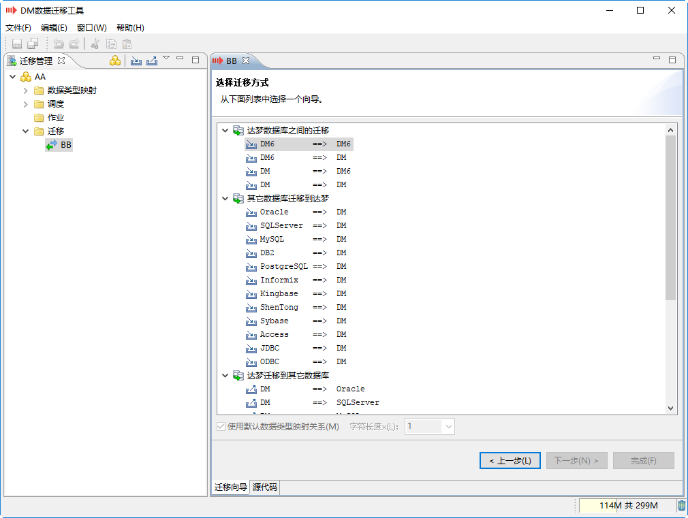
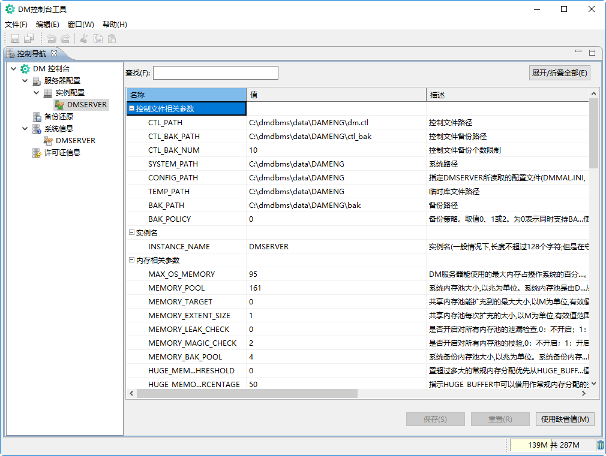
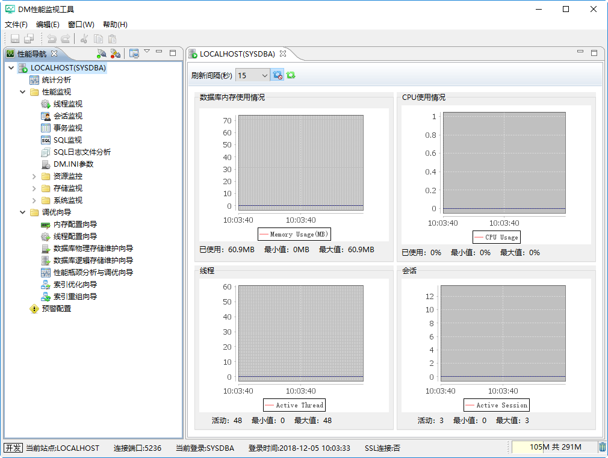
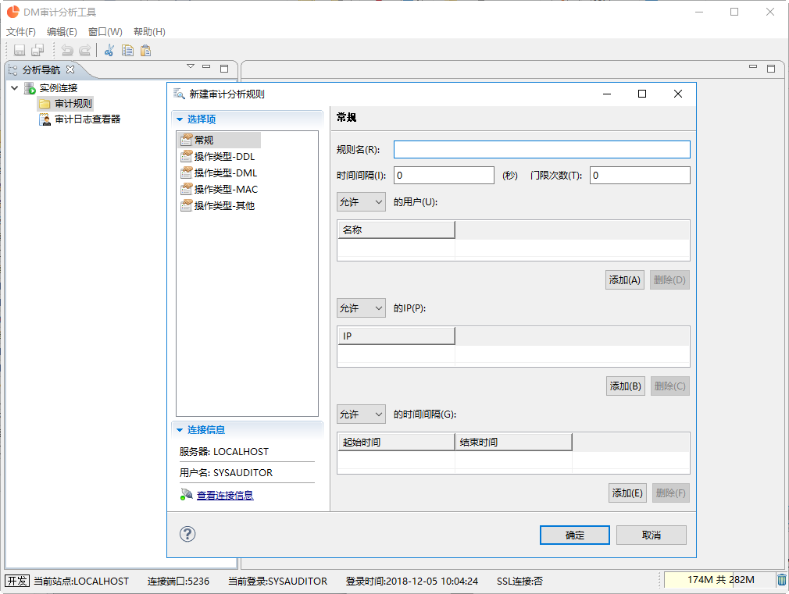

# DM8 安装简介

## 产品构成

达梦数据库管理系统是客户端/服务器架构的数据库系统，可运行在多种操作系统上。

### 产品版本

- **标准版**：面向中小型企业，提供基本的数据库功能。
- **企业版**：功能齐全，支持多 CPU、PB 级数据存储和高可靠性解决方案。
- **安全版**：在企业版基础上增强了安全特性，包含强制访问控制和四权分立机制。

### 服务器平台

支持 Windows、Linux、Solaris、AIX、HP-UNIX、FreeBSD 等操作系统，兼容 32 位和 64 位系统。

### 客户端工具

包含 Manager（管理工具）、DTS（迁移工具）、Console（控制台）、Monitor（监控）、Analyzer（审计分析）等工具，以及 ODBC、JDBC、DPI、PHP、Python 等驱动程序。

## 硬件环境需求

| 项目 | 要求 |
| --- | --- |
| CPU | 支持国产与国际主流处理器 |
| 内存 | 不低于 256MB，建议 512MB 以上 |
| 硬盘 | 5GB 以上可用空间 |
| 网卡 | 10M 以上，支持 TCP/IP 协议 |
| 显示 | 1024×768，256 色以上 |

## 软件环境需求

| 名称 | 要求 |
| --- | --- |
| 操作系统 | Windows 简体中文 Server SP2 及以上，或 Linux（glibc 2.3 及以上，内核 2.6） |
| 网络协议 | TCP/IP |
| 系统盘 | 1GB 以上剩余空间 |

## 计算机管理员准备工作

1. 正确安装操作系统，并合理分配磁盘空间。
2. 关闭杀毒软件和安全防护软件。
3. 确保网络环境正常。
4. 使用 32 位版本时，需确保系统时间在 1970 年 1 月 1 日至 2038 年 1 月 19 日之间。

## 数据库管理员准备工作

1. 重新安装前，应完全卸载原有版本并备份数据。
2. 每台服务器都必须安装服务器端组件。
3. 仅作客户机使用的计算机无需安装服务器端组件。

## 第三方代码及协议信息

### 服务器相关

服务器采用了 OpenSSL、XQilla、Xerces、libxslt、libxml2、ZLIB、SNAPPY、REGEX、armadillo、OpenBLAS 等第三方组件，许可证文件存放在安装目录下的 `samples/third_party_license/addons` 目录中。

### 客户端相关

客户端使用了 30 多个第三方库，涉及 Apache License 2.0、BSD、MIT、LGPL 等多种开源协议，许可证文件存放在 `client` 目录中。
