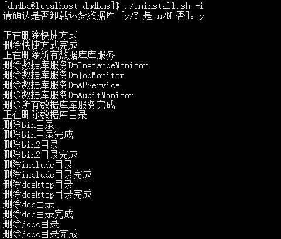
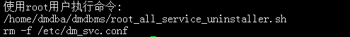
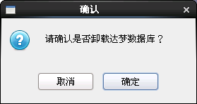
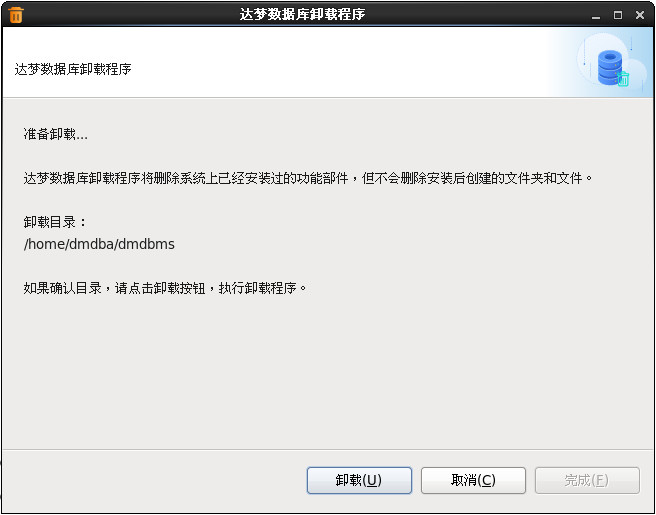
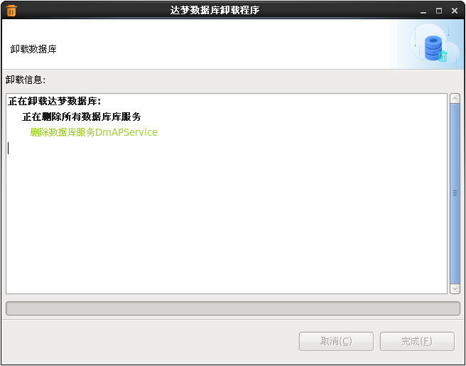
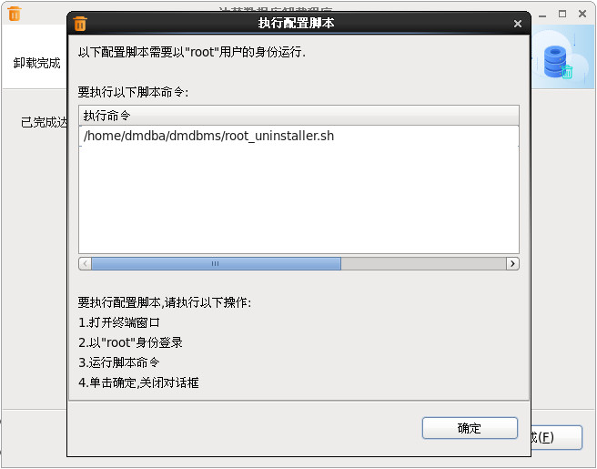
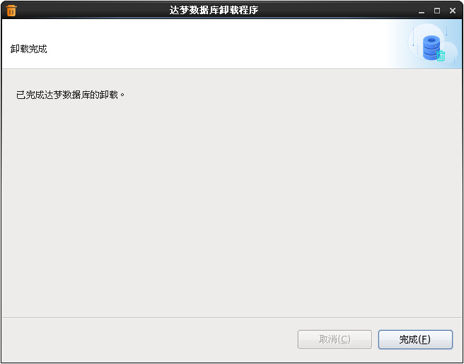

# Linux（Unix）下 DM 的卸载

DM 在 Linux 下提供命令行卸载和图形化卸载两种方式，卸载程序均为全部卸载。推荐优先使用命令行卸载。

## 命令行卸载

在安装目录下执行：

```bash
cd $DM_INSTALL_PATH
./uninstall.sh -i
```


卸载过程与图形化卸载一致，依次为确认卸载、显示卸载进度、提示执行 `root` 配置脚本。





## 图形化卸载

在安装目录下执行：

```bash
cd $DM_INSTALL_PATH
./uninstall.sh
```

### 运行卸载程序

程序会弹出提示框确认是否卸载。点击"确定"进入卸载小结页面，点击"取消"退出卸载程序。



### 卸载小结

显示 DM 的卸载目录信息，点击"卸载"开始卸载。



### 卸载

显示卸载进度。



> 卸载完成后，终端会提示需要以 `root` 用户执行配置脚本，根据提示完成相关操作即可。




