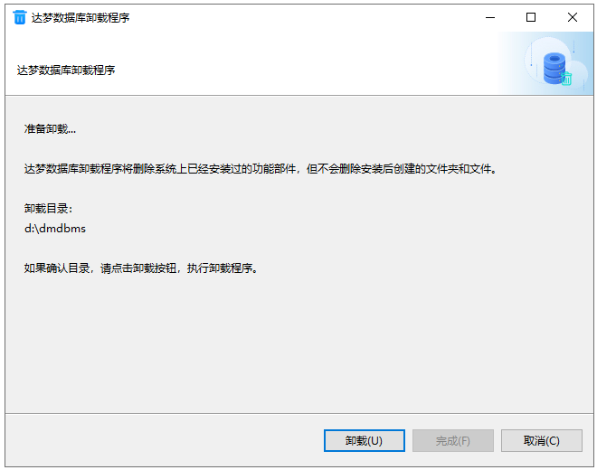
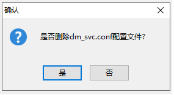
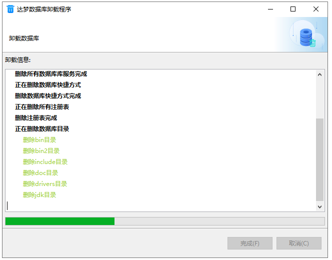
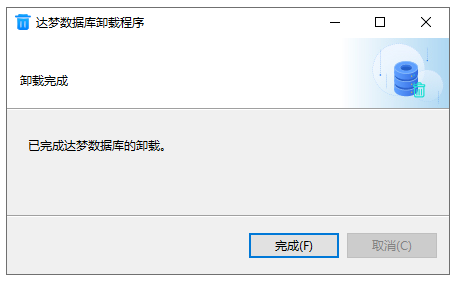

# Windows 下达梦数据库的卸载

达梦数据库提供的卸载方式为全部卸载。可在系统设置的"应用和功能"中选择"达梦数据库"卸载，或运行安装目录下的 `uninstall.exe`。

## 运行卸载程序

程序会弹出提示框确认是否卸载。点击"确定"进入卸载小结页面，点击"取消"退出卸载程序。

## 卸载小结

显示达梦数据库的卸载目录信息。

点击"卸载"后，会弹出消息框确认是否删除 `dm_svc.conf` 配置文件：点击"是"将在卸载时删除该文件；点击"否"则保留。

## 卸载

显示卸载进度。

点击"完成"按钮结束卸载。

> 卸载程序不会删除用户数据库文件以及使用过程中产生的文件，需要手动删除。

