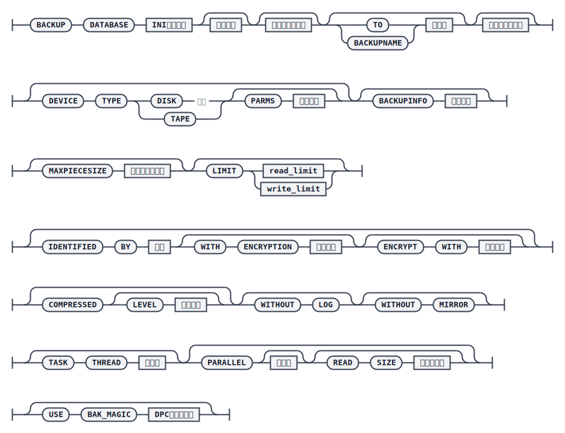

# BACKUP DATABASE

`BACKUP DATABASE` 命令用于备份整个数据库，包括完全备份和增量备份两种类型。使用 dmrman 执行脱机备份要求数据库实例处于关闭状态：正常退出的数据库，脱机备份前不需要配置归档；故障退出的数据库，则必须先执行归档修复（参见 [REPAIR ARCHIVE](./repair-archive)），才能进行备份。

在 dmrman 中输入以下命令即可完成最简单的数据库备份：

```plaintext
RMAN>BACKUP DATABASE '/opt/dmdbms/data/DAMENG/dm.ini';
```

命令执行完后会在默认的备份路径下生成备份集目录。默认备份路径为 `dm.ini` 中 `BAK_PATH` 配置的路径，若未配置，则使用 `SYSTEM_PATH` 下的 `bak` 目录。

## 语法



## 关键参数说明

- `DATABASE`：必选参数，指定备份源库的 `dm.ini` 文件路径。
- `<备份类型>`：取值为 `FULL`（完全备份）或 `INCREMENT`（增量备份）。若省略，默认执行完全备份。增量备份要求两次备份之间数据库必须有过操作，否则会报错；增量备份还需要通过 `WITH BACKUPDIR` 或 `BASE ON BACKUPSET` 指定基备份的搜索目录或路径，若基备份不在默认搜索路径下而未指定该参数，备份会失败。
- `TO | BACKUPNAME`：指定生成的备份名称。若未指定，系统会按 `DB_数据库名称_备份类型_备份时间` 的格式随机生成，例如 `DB_DAMENG_FULL_20240206_143057_123456`。备份名区分大小写，且不允许包含转义字符 `%`。
- `DEVICE TYPE`：备份集存储的介质类型，支持 `DISK` 和 `TAPE`，默认 `DISK`。`PARMS` 仅在介质类型为 `TAPE` 时有效。
- `BACKUPINFO`：备份的描述信息，最大不超过 256 个字节。
- `MAXPIECESIZE`：最大备份片文件大小上限，单位 MB，最小 128MB，32 位系统最大 2GB，64 位系统最大 128GB，缺省取最大值。
- `LIMIT`：限制备份时的读写速度，单位 MB/S，默认 0 表示无限制。
- `IDENTIFIED BY` / `WITH ENCRYPTION` / `ENCRYPT WITH`：用于加密备份。`WITH ENCRYPTION` 取值 0（不加密）、1（简单加密，仅设置口令，内容仍为明文）、2（完全数据加密），缺省为 1；`ENCRYPT WITH` 指定加密算法，缺省为 `AES256_CFB`。
- `COMPRESSED`：是否压缩备份数据，`LEVEL` 取值范围 0~9，级别越高压缩比越高但速度越慢；指定 `COMPRESSED` 但未指定 `LEVEL` 时默认为 1，不指定 `COMPRESSED` 则默认不压缩。
- `WITHOUT LOG`：是否备份 REDO 日志。指定该参数表示不备份；若使用了该参数，后续使用 dmrman 还原时必须指定 `WITH ARCHIVEDIR` 参数。
- `WITHOUT MIRROR`：是否备份镜像文件，指定该参数表示不备份。
- `TASK THREAD`：备份过程中数据处理线程的个数，取值范围 0~64，默认为 4；指定为 0 时调整为 1，超过主机核数时调整为主机核数。`TASK THREAD` 乘以 `PARALLEL` 不得超过 512。
- `PARALLEL`：指定并行备份的并行数和拆分块大小（`READ SIZE`）。
- `USE BAK_MAGIC`：仅在 DMDPC 环境下有效，指定 DPC 备份集魔数，用于唯一标识同一批次的 MP 和 BP 节点的备份集。

## 示例

创建完全备份（`FULL` 可省略，省略时默认就是完全备份）：

```plaintext
RMAN>BACKUP DATABASE '/opt/dmdbms/data/DAMENG/dm.ini' FULL BACKUPSET '/home/dm_bak/db_full_bak_01';
```

创建增量备份（增量备份时 `INCREMENT` 不可省略；如果基备份不在默认备份目录中，需要通过 `WITH BACKUPDIR` 指定基备份搜索目录，或事先使用 `CONFIGURE DEFAULT BACKUPDIR` 配置默认搜索目录）：

```plaintext
RMAN>BACKUP DATABASE '/opt/dmdbms/data/DAMENG/dm.ini' INCREMENT WITH BACKUPDIR
'/home/dm_bak'BACKUPSET '/home/dm_bak/db_increment_bak_02';
```

创建带加密的完全备份：

```plaintext
RMAN> BACKUP DATABASE '/opt/dmdbms/data/DAMENG/dm.ini' BACKUPSET
'/home/dm_bak/db_bak_for_encrypt_04' IDENTIFIED BY "Cdb546789" WITH ENCRYPTION 2 ENCRYPT WITH RC4;
```

## 使用说明

备份成功后会在备份集目录或默认备份目录下生成备份集，其中包括一个后缀为 `.meta` 的备份元数据文件，以及一个或多个后缀为 `.bak` 的备份片文件；并行备份的备份集中还会包含若干子备份集目录，每个子备份集目录中同样包含一个元数据文件和若干备份片文件。

`DDL_CLONE` 类型的库备份集不能作为增量备份的基备份，仅能用于库级还原；通过指定 `FROM LSN` 生成的库备份集也不能作为增量备份的基备份，仅能用于库级还原，且必须使用 [MERGE DATABASE](./restore-database#增量合并) 命令执行还原。

脱机备份的数据库可以是正常退出的，也可以是故障退出的；如果是故障退出的数据库，备份前需先进行归档修复。如果脱机数据库备份过程中报错归档不完整，需要检查库是否异常退出，如果是，则先执行归档修复。

`STANDBY` 模式下的库不支持脱机备份；备份还原回来但服务器未经过重启的库，以及 `STANDBY` 切换为 `PRIMARY` 后服务器未经过重启的库，均不支持脱机备份。只有建库时指定 `RLOG_GEN_FOR_HUGE` 参数为 1，备份数据库时才会备份 HUGE 表数据。
