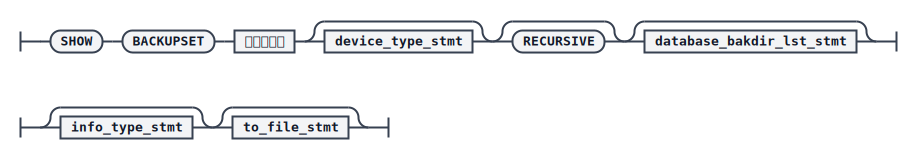
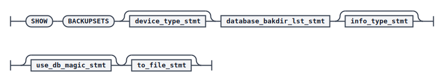

# SHOW BACKUPSET

dmrman 使用 `SHOW` 命令查看备份集的信息。`SHOW BACKUPSET` 用于查看单个备份集；`SHOW BACKUPSETS`（带 `S`）用于批量查看指定搜索目录下的多个备份集信息。若 `SHOW BACKUPSET` 指定的备份集为增量备份并同时指定 `RECURSIVE`，则会以该备份集为最新备份集，递归显示完整的备份集链表；否则仅显示指定备份集本身的信息。

## 语法

SHOW BACKUPSET（单个备份集）



SHOW BACKUPSETS（批量）



`<device_type_stmt>`


`<database_bakdir_lst_stmt>`


`<info_type_stmt>`


`<use_db_magic_stmt>`


`<to_file_stmt>`


## 关键参数说明

- `BACKUPSET` / `BACKUPSETS`：分别指定查看单个备份集或批量查看多个备份集。
- `DEVICE TYPE` / `PARMS`：备份集存储的介质类型，支持 `DISK` 和 `TAPE`，默认 `DISK`；`PARMS` 仅在介质类型为 `TAPE` 时有效。
- `DATABASE`：指定数据库 `dm.ini` 文件路径，若指定，则该数据库的默认备份目录会作为备份集搜索目录之一。
- `WITH BACKUPDIR`：备份集搜索目录，最大长度 256 字节。在 `SHOW BACKUPSET` 中用于为增量备份指定基备份的搜索目录；在 `SHOW BACKUPSETS` 中用于批量查看指定目录下符合条件的所有备份集信息。
- `INFO <信息类型>`：指定显示的信息内容，可组合指定，多个类型间用逗号分隔，未指定时显示全部。信息类型包括 `DB`（数据库信息）、`META`（元信息）、`FILE`（文件信息）、`TABLESPACE`（表空间信息，对库备份集和表空间备份集有效）、`TABLE`（表信息，仅对表备份集有效）。
- `USE DB_MAGIC`：仅 `SHOW BACKUPSETS` 支持，指定一个 `DB_MAGIC`，只显示该 `DB_MAGIC` 对应数据库的备份集信息，常用于在同一目录下混有多个数据库备份集时按数据库筛选。
- `TO ... FORMAT`：将备份集信息输出到文件，支持 `TXT`（默认）和 `XML` 两种格式，不支持输出到 DMASM 文件系统；目标文件不能已经存在，否则报错。

## 示例

查看单个备份集的全部信息：

```plaintext
RMAN> show backupset '/home/test/dmdbms/DAMENG/bak/DB_DAMENG_FULL_20251201_092827_572432'
```

批量查看多个搜索目录下的备份集信息：

```plaintext
RMAN>SHOW BACKUPSETS WITH BACKUPDIR '/home/dm_bak1','/home/dm_bak2';
```

只查看某个特定数据库的所有备份集：先查看某个备份集信息获取其 `DB_MAGIC`（如此例中为 `1447060265`），再通过 `USE DB_MAGIC` 筛选：

```plaintext
RMAN>SHOW BACKUPSET '/home/dm_bak/db_bak_for_show_db_magic_01';
RMAN>SHOW BACKUPSETS WITH BACKUPDIR '/home/dm_bak' USE DB_MAGIC 1447060265;
```

只显示备份集的元数据信息（关键字顺序为 `DB`、`META`、`FILE`、`TABLESPACE`、`TABLE`，可任意组合）：

```plaintext
RMAN> show backupset '/home/test/dmdbms/DAMENG/bak/DB_DAMENG_FULL_20251201_092827_572432' info meta
```

以 XML 格式将备份集信息输出到文件：

```plaintext
RMAN>SHOW BACKUPSET '/home/dm_bak1/db_bak_for_xml_01' TO
'/home/dm_info/bkp_info.txt' FORMAT XML;
```

## 输出内容说明

`SHOW` 命令输出的备份集信息主要分为几部分：以 `<DB INFO>` 开头的数据库信息（记录源库的系统路径、`db_magic`、页大小、字符集等属性）；以 `<META INFO>` 开头的元信息（记录备份集标识、备份类型、备份范围、起止 LSN 等）；以 `<FILE INFO>` 开头的文件信息（记录备份片、数据文件、归档文件、HUGE 文件等明细）；以及表空间信息（`<TABLESPACE INFO>`）和表信息（`<TABLE INFO>`，仅表备份集有效）。这些信息在排查问题、确认备份范围、获取 `DB_MAGIC` 用于跨库归档恢复时都非常有用，具体字段含义请参考《DM8 系统管理员手册》或《DM8 备份与还原》手册中的对应表格。
