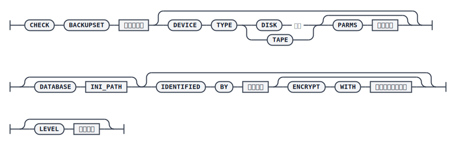

# CHECK BACKUPSET

`CHECK BACKUPSET` 命令用于对备份集进行校验，确认备份集是否存在以及内容是否合法。每次只能校验一个备份集，建议在执行还原或恢复之前先对待用的备份集做一次校验。

## 语法



## 关键参数说明

- `BACKUPSET`：指定待校验的备份集目录。
- `DEVICE TYPE` / `PARMS`：备份集存储的介质类型，支持 `DISK` 和 `TAPE`，默认 `DISK`；`PARMS` 仅在介质类型为 `TAPE` 时有效。
- `DATABASE`：数据库 `dm.ini` 文件路径，若指定，则该数据库的默认备份目录会作为备份集搜索目录之一，常用于以相对路径指定备份集时。
- `IDENTIFIED BY`：指定备份时使用的加密密码，供校验过程中解密数据页使用。密码可以用双引号括起来，以避免特殊字符无法通过语法检测，密码规则遵从 INI 参数 `PWD_POLICY` 和 `PWD_MIN_LEN` 指定的口令策略。
- `ENCRYPT WITH`：指定备份时使用的加密算法，供解密使用；若未指定，则使用默认算法 `AES256_CFB`。
- `LEVEL`：备份集校验级别。`1` 仅校验备份包的 CRC；`2` 校验数据页的 CRC；`3` 在校验数据页 CRC 的基础上执行解密校验。若未指定，默认为 1。备份时只有 `dm.ini` 中 `BAK_SAFE_CHECK` 设置为 8~15，生成的备份集才支持指定校验级别为 2 或 3。

## 示例

校验一个指定绝对路径的备份集：

```plaintext
RMAN>BACKUP DATABASE '/opt/dmdbms/data/DAMENG/dm.ini' BACKUPSET'/home/dm_bak/db_bak_for_check_01';

RMAN>CHECK BACKUPSET '/home/dm_bak/db_bak_for_check_01';
```

若备份集位于数据库的默认备份目录下，可以只指定相对路径，再配合 `DATABASE` 参数定位：

```plaintext
RMAN>BACKUP DATABASE '/opt/dmdbms/data/DAMENG/dm.ini' BACKUPSET'db_bak_for_check_02';

RMAN>CHECK BACKUPSET 'db_bak_for_check_02' DATABASE '/opt/dmdbms/data/DAMENG/dm.ini';
```
