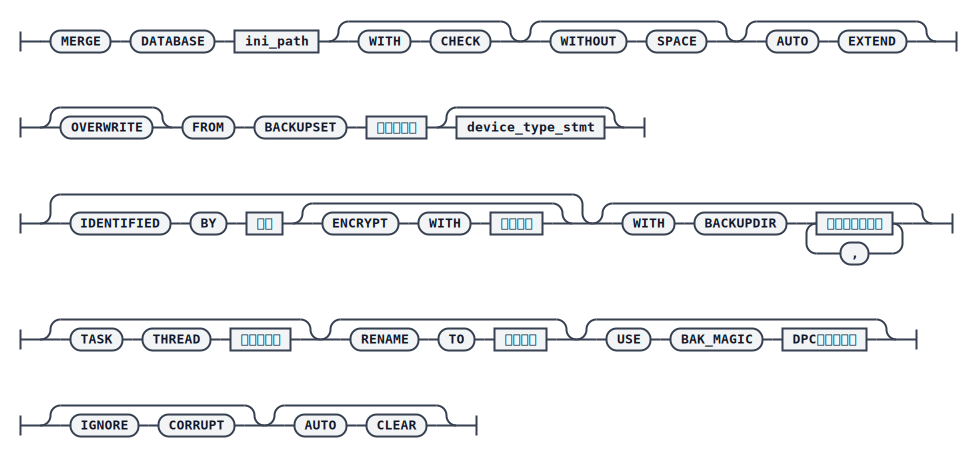

# MERGE DATABASE（增量合并）

在实际运维中，单纯依赖某一次完全备份或增量备份执行还原恢复是相当耗时的操作：数据库一旦意外损坏，才着手用备份集修复数据，会导致数据库服务中断较长时间。为了缩短故障恢复窗口，dmrman 提供 `MERGE` 命令，可以按周期把增量备份集预先合并到一个备用库中；一旦源库故障，只需要重演最后一个时间窗口内的归档日志即可将备用库恢复到最新状态，从而实现更快速的恢复。

除了周期性合并增量备份集外，`MERGE` 命令还用于还原通过 `BACKUP DATABASE ... FROM LSN ...` 语法生成的库备份集——这类备份集不能作为常规增量备份的基备份，只能用 `MERGE` 命令执行还原。

## 语法



`<device_type_stmt>`


## 周期性备份与合并示例

以单机环境为例，源库路径为 `/opt/dmdbms/data/db_for_bak/dm.ini`，归档目录为 `/opt/dmdbms/data/db_for_bak/arch`。

按周执行完全备份，按天执行增量备份：

```plaintext
-- 周日执行完全备份
SQL> BACKUP DATABASE BACKUPSET '/opt/dmdbms/data/bak/DB_FULL_BAK';
```

使用完全备份集还原出一个新库作为合并目标库（还原后不能再执行恢复操作，否则后续无法继续合并增量备份集）：

```plaintext
RMAN> RESTORE DATABASE to '/opt/dmdbms/data/db_for_merge' FROM BACKUPSET '/opt/dmdbms/data/bak/DB_FULL_BAK'
```

一周内其余每天生成增量备份集：

```plaintext
SQL> BACKUP DATABASE INCREMENT BACKUPSET 'DB_INCR_BAK';
```

定期把增量备份集合并到目标库：

```plaintext
RMAN> MERGE DATABASE '/opt/dmdbms/data/db_for_merge/dm.ini' FROM BACKUPSET '/opt/dmdbms/data/bak/DB_INC_BAK'
```

源库故障后，只需重演最后一个时间窗口内的归档日志，将目标库恢复到最新状态，再更新数据库魔数标识恢复操作完成，即可正常启动新库提供服务：

```plaintext
RMAN> RECOVER DATABASE '/opt/dmdbms/data/db_for_merge/dm.ini' WITH ARCHIVEDIR '/opt/dmdbms/data/db_for_bak/arch'
RMAN> RECOVER DATABASE '/opt/dmdbms/data/db_for_merge/dm.ini' UPDATE DB_MAGIC
```

:::warning 注意
用于定期合并的增量备份集不能是指定 `CUMULATIVE` 关键字生成的累积增量备份集。由于累积增量备份的基备份只能是完全备份集，定期合并累积增量备份集数据时可能出现合并失败的情况。
:::

## 还原 FROM LSN 备份集

使用通过 `FROM LSN` 生成的库备份集执行数据库还原时，存在以下限制：

- 还原目标库必须是正常退出的数据库。
- 在集群环境下，源库和目标库必须从属于同一集群，且目标库必须是集群中的备库。
- 备份时指定的 `FROM LSN` 必须小于等于目标库最小的 `APPLY_LSN`。
- 备份集的 `END_LSN`（即备份结束时系统的 `CUR_LSN`）必须大于等于目标库最大的 `APPLY_LSN`。
- 备份时指定的 `FROM LSN` 必须小于等于目标库的检查点 LSN。
- 若还原目标库为 DMDSC 集群，由于集群中的控制节点负责重演主库日志，上述目标库 LSN 相关信息均以控制节点为准。

典型场景为主备集群因主库归档缺失导致无法继续日志同步，此时可在主库上按 `APPLY_LSN` 生成增量备份集，传输到备库后用 `MERGE` 命令修复：

```plaintext
RMAN> MERGE DATABASE '/opt/dmdbms/db_standby/dm.ini' FROM BACKUPSET '/opt/dmdbms/bak/bak_inc_lsn'
```

合并完成后，依次执行恢复和更新数据库魔数：

```plaintext
RMAN> RECOVER DATABASE '/opt/dmdbms/db_standby/dm.ini' FROM BACKUPSET '/opt/dmdbms/bak/bak_inc_lsn'
RMAN> RECOVER DATABASE '/opt/dmdbms/db_standby/dm.ini' UPDATE DB_MAGIC
```

之后重新启动备库，即可重新加入主备集群。
