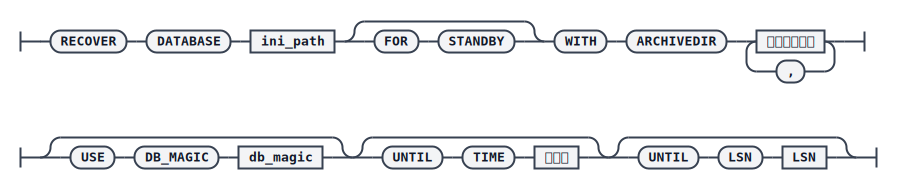
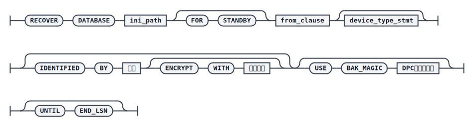

# RECOVER DATABASE

数据库通过 [RESTORE DATABASE](./restore-database) 还原之后通常还不可用，需要使用 `RECOVER` 命令完成数据库恢复：重做 REDO 日志，将数据更新到一致状态。如果还原后数据已经处于一致状态（例如正常关闭库的脱机备份还原），可以跳过恢复，直接进入数据库更新（`UPDATE DB_MAGIC`）阶段。

恢复方式分为两种：从备份集恢复，即重做备份集中保存的 REDO 日志；从归档恢复，即重做归档中的 REDO 日志。数据库恢复过程中不允许异常中断，恢复完成后还需要执行数据库更新操作，才能将库调整为可正常工作的状态。

## 语法

恢复一致性（从归档恢复）



从备份集恢复



`<from_clause>`


`<device_type_stmt>`


## 关键参数说明

- `DATABASE`：指定还原目标库的 `dm.ini` 文件路径。
- `WITH ARCHIVEDIR`：本地归档日志的搜索目录，缺省情况下在 `dmarch.ini` 中指定的归档目录中搜索。
- `USE DB_MAGIC`：指定本地归档日志对应数据库的 `DB_MAGIC`；若不指定，则默认使用目标数据库的 `DB_MAGIC`。主备环境中若当前节点归档缺失，可借助另一节点的归档，并通过该参数跳过 `DB_MAGIC` 一致性的默认限制。
- `UNTIL TIME`：恢复到指定的时间点。如果指定的时间早于备份结束时间，则忽略该参数，重做所有小于备份结束 LSN（`END_LSN`）的日志，恢复到备份结束时间点状态；此时无法精确恢复到 `END_LSN`，只能保证重演到 `END_LSN` 之后第一个时间戳日志（其 LSN 略大于 `END_LSN`）。
- `UNTIL LSN`：恢复到指定的 LSN；如果指定的 LSN 小于备份结束 LSN（`END_LSN`），则报错。
- `FOR STANDBY`：将目标库作为备库恢复，重演 REDO 日志时确保重演完整的日志包，以便启动后能正确加入数据守护集群或 DMDPC 的多副本系统。
- `BACKUPSET` / `BACKUPNAME`：从备份集恢复时指定备份集路径或备份名称。
- `DEVICE TYPE` / `PARMS`：备份集存储的介质类型，支持 `DISK` 和 `TAPE`，默认 `DISK`；`PARMS` 仅 `TAPE` 介质有效。
- `IDENTIFIED BY` / `ENCRYPT WITH`：恢复加密备份集时使用的解密密码及对应加密算法，未指定算法时默认 `AES256_CFB`。
- `USE BAK_MAGIC`：仅 DMDPC 环境下有效，含义与 [RESTORE DATABASE](./restore-database) 中相同。
- `UNTIL END_LSN`：在 DMDPC 多副本系统中，若使用联机备份集或节点异常退出的脱机备份集恢复一致性，建议指定该参数，强制恢复到 `END_LSN`，以保证各节点恢复到一致的数据状态。
- `UPDATE DB_MAGIC`：更新数据库的 `DB_MAGIC`，并将数据库调整为可正常工作状态。该操作发生在重做日志恢复数据库之后，或目标库本身已处于一致状态、不需要重做日志的情况下。

## 示例：从备份集恢复

```plaintext
RMAN>CHECK BACKUPSET '/home/dm_bak/db_full_bak_for_recover_backupset';
RMAN>RESTORE DATABASE '/opt/dmdbms/data/DAMENG_FOR_RESTORE/dm.ini' FROM BACKUPSET '/home/dm_bak/db_full_bak_for_recover_backupset';
RMAN>RECOVER DATABASE '/opt/dmdbms/data/DAMENG_FOR_RESTORE/dm.ini' FROM BACKUPSET '/home/dm_bak/db_full_bak_for_recover_backupset';
RMAN>RECOVER DATABASE '/opt/dmdbms/data/DAMENG_FOR_RESTORE/dm.ini' UPDATE DB_MAGIC;
```

## 示例：从归档恢复

```plaintext
RMAN>RESTORE DATABASE '/opt/dmdbms/data/DAMENG_FOR_RESTORE/dm.ini' FROM BACKUPSET '/home/dm_bak/db_full_bak_for_recover_arch';
RMAN>RECOVER DATABASE '/opt/dmdbms/data/DAMENG_FOR_RESTORE/dm.ini' WITH ARCHIVEDIR '/home/dm_arch/arch' USE DB_MAGIC 1447060265;
```

若恢复过程中出现归档不足的错误，可使用归档校验工具 `dmrachk` 检查归档目录的连续性，确定缺失范围后补齐归档文件再重新执行恢复。

## 示例：恢复到指定时间点 / LSN

```plaintext
RMAN> RESTORE DATABASE '/opt/dmdbms/data/DAMENG_FOR_RESTORE/dm.ini' FROM BACKUPSET '/home/dm_bak/db_full_bak_for_time_lsn';
RMAN>RECOVER DATABASE '/opt/dmdbms/data/DAMENG_FOR_RESTORE/dm.ini' WITH ARCHIVEDIR '/home/dm_arch/arch' UNTIL TIME '2018-11-16 10:56:40';
```

或恢复到指定 LSN：

```plaintext
RMAN>RECOVER DATABASE '/opt/dmdbms/data/DAMENG_FOR_RESTORE/dm.ini' WITH ARCHIVEDIR '/home/dm_arch/arch' UNTIL LSN 50857;
```

## 使用说明

`RECOVER DATABASE` 不仅可以从单一来源（备份集或归档）恢复，也支持组合使用，覆盖主备环境跨节点收集归档、DMDSC 多节点恢复、多次故障后使用不同数据库归档恢复等高级场景，核心思路都是：先 `RESTORE` 还原数据文件，再 `RECOVER` 重做日志，最后 `RECOVER DATABASE ... UPDATE DB_MAGIC` 完成数据库更新。

:::tip 小窍门
数据库恢复到一致性状态之后，也可以不执行更新操作，而是在实例启动时配置 `RECOVER_CHECK=0`，以备库配置状态启动数据库，对其进行只读访问。
:::

:::warning 注意
使用 `DDL_CLONE` 方式备份的数据库不支持指定归档恢复；指定归档恢复时也不建议使用联机状态下源库的归档，因为此时无法保证归档的完整性。
:::
