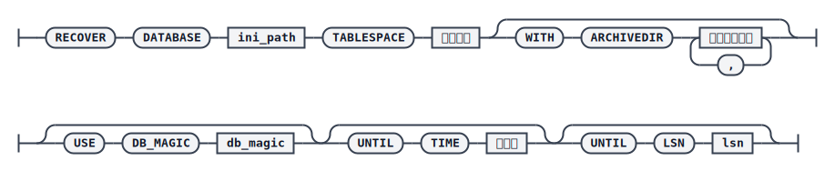

# RECOVER TABLESPACE

表空间还原（[RESTORE TABLESPACE](./restore-tablespace)）之后，需要使用 `RECOVER` 命令完成表空间恢复：重做 REDO 日志，将数据更新到一致状态。由于日志重做过程中，修改后的数据页会先存入缓冲区再分批写盘，因此表空间恢复过程中不允许异常中断，否则可能造成数据不一致，导致数据库启动时校验失败。

恢复完成后，表空间状态会被置为 `ONLINE`，并设置数据标记 `FIL_TS_RECV_STAT_RECOVERED`，表示数据已恢复到一致状态。

## 语法



## 关键参数说明

- `DATABASE`：指定还原目标库的 `dm.ini` 文件路径。
- `TABLESPACE`：指定待恢复的表空间，`TEMP` 表空间除外。
- `WITH ARCHIVEDIR`：归档日志搜索目录。缺省情况下在 `dmarch.ini` 中指定的归档目录中搜索；如果归档日志不在该目录下，或分散在多个目录中，需要使用该参数显式指定搜索目录。
- `USE DB_MAGIC`：指定本地归档日志对应数据库的 `DB_MAGIC`；若不指定，默认使用目标恢复数据库的 `DB_MAGIC`。主备环境下若当前节点归档缺失，可借助另一节点的归档并通过该参数跳过默认的一致性限制。
- `UNTIL TIME`：恢复到指定时间点；若该时间早于备份结束时间，则忽略该参数，重做所有小于 `END_LSN` 的日志，效果同从备份结束点恢复。
- `UNTIL LSN`：恢复到指定 LSN；若小于备份结束 LSN（`END_LSN`），则报错。`UNTIL LSN` 与 `UNTIL TIME` 同时指定时，任一条件满足即可完成恢复，同时满足时以先达到的为准。

:::warning 注意
表空间恢复时指定 LSN 或时间点，恢复完成后并不保证数据库整体数据的一致性，需要用户自行保证恢复操作的正确性。
:::

## 示例：常规恢复

```plaintext
RMAN>RESTORE DATABASE '/opt/dmdbms/data/DAMENG_FOR_RECOVER/dm.ini' TABLESPACE MAIN FROM BACKUPSET '/home/dm_bak/ts_full_bak_for_recover';
RMAN>RECOVER DATABASE '/opt/dmdbms/data/DAMENG_FOR_RECOVER/dm.ini' TABLESPACE MAIN;
```

## 示例：指定多个归档目录恢复

数据库归档可能因磁盘空间原因分布在多个目录下，此时可在 `WITH ARCHIVEDIR` 中列出多个目录：

```plaintext
RMAN>RESTORE DATABASE '/home/xm/DAMENG/dm.ini' TABLESPACE MAIN FROM BACKUPSET '/home/dm_bak/ts_bak_for_arch';
RMAN>RECOVER DATABASE '/home/xm/DAMENG/dm.ini' TABLESPACE MAIN WITH ARCHIVEDIR '/home/dm_arch1', '/home/dm_arch2';
```

## 示例：主备环境下指定 DB_MAGIC 收集归档

主备环境下，如果当前节点归档缺失，默认只收集与待恢复库 `DB_MAGIC`、`PERMANENT_MAGIC` 一致的归档文件；由于主备环境中 `PERMANENT_MAGIC` 是一致的，可借助指定 `DB_MAGIC` 跳过这一限制，使用备库保存的归档恢复主节点：

```plaintext
RMAN>RESTORE DATABASE '/home/xm/DAMENG/dm.ini' TABLESPACE MAIN FROM BACKUPSET '/home/dm_bak/ts_bak_for_arch';
RMAN>RECOVER DATABASE '/home/xm/DAMENG/dm.ini' TABLESPACE MAIN WITH ARCHIVEDIR '/home/dm_arch2' USE DB_MAGIC 18446520;
```
