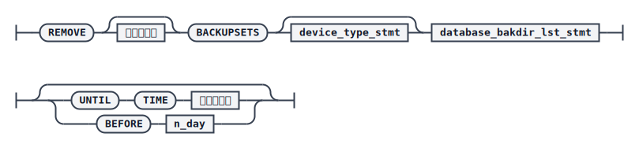
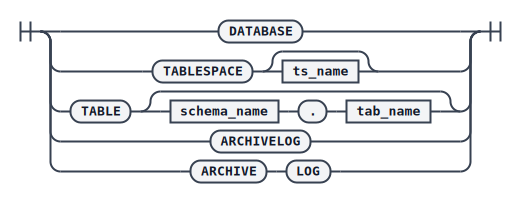

# REMOVE BACKUPSET

管理备份的一个重要目的是删除不再需要的备份集。dmrman 使用 `REMOVE` 命令删除备份集，既可以删除单个备份集，也可以批量删除备份集。单个备份集删除时，并行备份中的子备份集不允许单独删除；如果在指定的备份集搜索目录中发现该备份集被其他增量备份引用为基备份，默认会报错，需要级联删除才能继续。批量删除备份集时，会跳过收集到的单独的子备份集。

## 语法

REMOVE BACKUPSET（单个备份集）


REMOVE BACKUPSETS（批量）



`<device_type_stmt>`


`<database_bakdir_lst_stmt>`


`<备份集类型>`



## 关键参数说明

- `BACKUPSET`：指定待删除的单个备份集目录。
- `DEVICE TYPE` / `PARMS`：备份集存储的介质类型，支持 `DISK` 和 `TAPE`，默认 `DISK`；`PARMS` 仅在介质类型为 `TAPE` 时有效。需要注意，目前达梦数据库的介质管理不支持对 `TAPE` 类型介质的备份集执行删除，若使用支持此操作的第三方介质管理，方可指定 `DEVICE TYPE TAPE` 子句。
- `DATABASE`：指定数据库 `dm.ini` 文件路径，若指定，该数据库的默认备份目录会作为备份集搜索目录之一。
- `WITH BACKUPDIR`：备份集搜索目录，用于搜索指定目录下的所有备份集。
- `CASCADE`：当目标备份集已被其他增量备份引用为基备份时，默认不允许删除；指定 `CASCADE` 则递归删除所有引用该备份集的增量备份。
- `<备份集类型>`：批量删除时可指定 `DATABASE`（库级备份）、`TABLESPACE`（表空间级备份，可附带表空间名仅删除该表空间的备份）、`TABLE`（表级备份，可附带模式名和表名仅删除该表的备份）、`ARCHIVELOG` 或 `ARCHIVE LOG`（两者等价，归档级备份）。若不指定备份集类型，则删除所有类型的备份集。
- `UNTIL TIME`：删除生成时间早于指定时间点的所有备份集；若未指定，则删除所有满足条件的备份集。
- `BEFORE`：删除距当前时间 `n_day` 天之前生成的备份集，`n_day` 取值范围 0~365，单位为天。

## 示例

删除一个特定的备份集（若该备份集已被引用为其他备份的基备份且未指定 `CASCADE`，则报错）：

```plaintext
RMAN>BACKUP DATABASE '/opt/dmdbms/data/DAMENG/dm.ini' BACKUPSET'/home/dm_bak/db_bak_for_remove_01';

RMAN>REMOVE BACKUPSET '/home/dm_bak/db_bak_for_remove_01';
```

若备份集在数据库默认备份目录下，可以配合 `DATABASE` 参数删除：

```plaintext
RMAN>REMOVE BACKUPSET 'db_bak_for_remove_01' DATABASE '/opt/dmdbms/data/DAMENG/dm.ini';
```

级联删除被增量备份引用为基备份的备份集：

```plaintext
RMAN> REMOVE BACKUPSET 'db_bak_for_remove_01' DATABASE '/opt/dmdbms/data/DAMENG/dm.ini' CASCADE;
```

批量删除指定目录下的所有备份集（不限定备份类型，可以是联机生成的，也可以是 dmrman 脱机生成的）：

```plaintext
RMAN>REMOVE BACKUPSETS WITH BACKUPDIR '/home/dm_bak';
```

批量删除指定时间之前的备份集，例如删除 7 天前 `/home/dm_bak` 目录下的所有备份：

```plaintext
RMAN> REMOVE BACKUPSETS WITH BACKUPDIR '/home/dm_bak' UNTIL TIME '2024-6-1 00:00:00';
```
