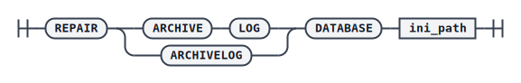

# REPAIR ARCHIVE LOG

使用 `REPAIR` 命令完成指定数据库的归档修复。归档修复会对目标库 `dmarch.ini` 中配置的所有本地归档日志目录执行修复；若目标库没有配置本地归档，则不执行修复。执行修复时，目标库一定不能处于运行状态。

一般建议在数据库故障后立即执行归档修复，否则后续执行还原恢复时，联机日志中尚未刷入本地归档的 REDO 日志会丢失，届时再利用本地归档恢复将无法恢复到故障前的最新状态。

## 语法



## 示例

单机环境下，确保目标库已经停止工作后再执行归档修复：

```plaintext
RMAN> REPAIR ARCHIVELOG DATABASE '/opt/dmdbms/data/dm.ini';
```

DSC 环境下，需要每个节点都停止工作后，分别在每个节点上独立执行修复操作。例如对两节点 DSC01、DSC02 分别执行：

```plaintext
RMAN> REPAIR ARCHIVELOG DATABASE '/opt/dmdbms/dsc/dm01.ini';
RMAN> REPAIR ARCHIVELOG DATABASE '/opt/dmdbms/dsc/dm02.ini';
```

## 使用场景

归档修复常见于以下两类场景：

- **备份前修复**：数据库故障退出后，若要执行脱机备份，必须先进行归档修复，确保本地归档完整，否则备份会失败。
- **恢复前修复**：当还原目标库与故障库是同一个库时，建议先执行该库的归档修复，再进行后续的还原与恢复操作；当源库使用本地归档恢复且联机日志中存在尚未同步到归档文件的 REDO 日志时，也需要先修复归档，才能保证后续利用归档文件将目标数据库恢复到最新状态。
