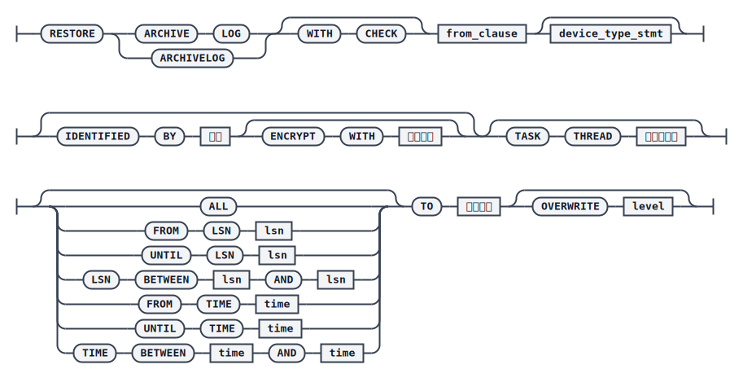
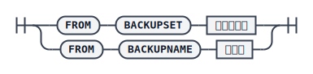
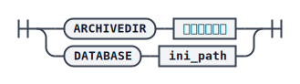

# RESTORE ARCHIVE LOG

`RESTORE` 命令也可以用于完成归档的脱机还原，在还原语句中指定归档备份集，该备份集可以是脱机生成的，也可以是联机生成的。还原归档实质上是把备份集中保存的归档日志文件释放回指定的归档目录，或某个数据库的归档目录中。

## 语法



`<from_clause>`



`<device_type_stmt>`


`<还原目录>`



## 关键参数说明

- `WITH CHECK`：还原前先校验备份集数据完整性，缺省不校验。
- `BACKUPSET`：指定用于还原归档的备份集路径。若为相对路径，会在 `<还原目录>` 中 `DATABASE` 对应的默认数据库备份目录下搜索；若 `<还原目录>` 指定的是 `ARCHIVEDIR`，则 `BACKUPSET` 必须使用绝对路径。
- `BACKUPNAME`：指定用于还原归档的备份名称，在备份集搜索目录下搜索。
- `DEVICE TYPE` / `PARMS`：备份集存储的介质类型，支持 `DISK` 和 `TAPE`，默认 `DISK`；`PARMS` 仅 `TAPE` 介质有效。
- `IDENTIFIED BY` / `ENCRYPT WITH`：还原加密备份集时使用的解密密码及对应加密算法，未指定算法时默认 `AES256_CFB`。
- `TASK THREAD`：还原过程中用于解压缩和解密任务的线程个数，未指定默认为 4，指定为 0 调整为 1，超过主机核数时调整为主机核数。
- `ALL`：还原所有归档，若不指定其他范围条件，默认即为 `ALL`。
- `FROM LSN` / `FROM TIME`：指定还原的起始 LSN 或起始时间点；真正的起始点是该 LSN 或时间点所在的整个归档日志文件。
- `UNTIL LSN` / `UNTIL TIME`：指定还原的截止 LSN 或截止时间点；真正的截止点是该 LSN 或时间点所在的整个归档日志文件。
- `LSN BETWEEN ... AND ...` / `TIME BETWEEN ... AND ...`：指定还原的区间，区间内涉及到的所有归档日志文件都会被还原（只要文件的 LSN 范围与区间有交集）。
- `ARCHIVEDIR`：指定还原的目标归档日志目录。
- `DATABASE`：指定还原目标库的 `dm.ini` 文件路径，将归档日志还原到该库的归档日志目录中。
- `OVERWRITE`：指定归档日志已存在时的处理方式，取值 1、2、3。`1` 表示跳过已存在的日志，继续还原其他日志，跳过记录会写入安装目录 `log` 目录下的 `dm_BAKRES_年月.log`；`2` 表示直接报错返回（缺省值）；`3` 表示强制覆盖已存在的归档日志。

## 示例

先联机备份归档（保证数据库运行在归档模式及 `OPEN` 状态），并校验备份集：

```plaintext
BACKUP ARCHIVE LOG ALL BACKUPNAME ARCH_ALL_BAK_01 BACKUPSET '/home/dm_bak/arch_all_for_restore';
RMAN> CHECK BACKUPSET '/home/dm_bak/arch_all_for_restore';
```

指定还原的目标归档日志目录：

```plaintext
RMAN> RESTORE ARCHIVE LOG FROM BACKUPSET '/home/dm_bak/arch_all_for_restore' TO ARCHIVEDIR'/opt/dmdbms/data/DAMENG_FOR_RESTORE/arch_dest' OVERWRITE 2;
```

或指定还原目标库的 `dm.ini` 文件路径：

```plaintext
RMAN> RESTORE ARCHIVE LOG FROM BACKUPSET '/home/dm_bak/arch_all_for_restore' TO DATABASE '/opt/dmdbms/data/DAMENG_FOR_RESTORE/dm.ini' OVERWRITE 2;
```

也可以指定备份名称进行还原：

```plaintext
RMAN> RESTORE ARCHIVE LOG FROM BACKUPNAME ARCH_ALL_BAK_01 TO DATABASE '/opt/dmdbms/data/DAMENG_FOR_RESTORE/dm.ini' OVERWRITE 2;
```
