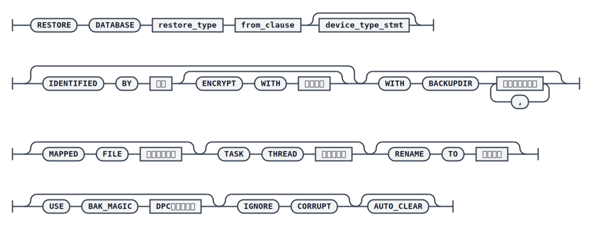
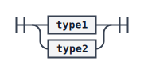

# RESTORE DATABASE

`RESTORE` 命令用于完成数据库的脱机还原操作，还原语句中指定的库级备份集可以是脱机生成的，也可以是联机生成的。数据库还原包括数据库配置文件还原和数据文件还原，可能需要还原的配置文件包括 `dm.ini`、`dm.ctl`、服务器密钥文件（`dm_service.prikey` 或 `dm_external.config`，若备份时指定了 USBKEY 加密则无密钥文件）以及联机日志文件。

通过 `RESTORE` 命令还原后的数据库还不能直接使用，需要进一步执行 [RECOVER DATABASE](./recover-database) 命令，将数据库恢复到备份结束时的状态。

## 语法



`<restore_type>`



`<type1>`


`<type2>`


`<from_clause>`


`<device_type_stmt>`


## 关键参数说明

- `DATABASE`：指定还原目标库的 `dm.ini` 文件路径（`<type1>`），或指定目标目录路径（`<type2>`，将其作为 `system.dbf` 所在路径处理，可以不存在但路径必须有效）。
- `BACKUPSET` / `BACKUPNAME`：分别指定用于还原的备份集路径或备份名称（在备份集搜索目录下搜索）。`BACKUPSET` 若指定相对路径，会在默认备份目录下搜索。
- `DEVICE TYPE` / `PARMS`：备份集存储的介质类型，支持 `DISK` 和 `TAPE`，默认 `DISK`；`PARMS` 仅 `TAPE` 介质有效。
- `IDENTIFIED BY` / `ENCRYPT WITH`：还原加密备份集时使用的解密密码及对应加密算法，未指定算法时默认 `AES256_CFB`。
- `WITH BACKUPDIR`：用于增量备份还原时指定基备份搜索目录，最大长度 256 字节；若缺省，会按磁盘、S3、REMOTE 等不同介质类型自动在相应的默认路径中搜索（如磁盘介质会搜索 `CONFIGURE ADD` 添加的目录及当前备份集目录的上一级目录）。如果基备份不在这些默认路径下，增量备份还原时必须显式指定该参数。
- `MAPPED FILE`：指定映射文件路径，用于重新指定备份集中数据文件还原后的目标路径；当该参数与 `BACKUPSET` 指定路径不一致时，以映射文件中的路径为准。
- `TASK THREAD`：还原过程中用于处理解压缩和解密任务的线程个数，未指定默认为 4，指定为 0 调整为 1，超过主机核数则调整为主机核数。
- `RENAME TO`：还原后修改数据库名称；未指定则使用备份集中记录的 `db_name`。
- `USE BAK_MAGIC`：仅 DMDPC 环境下有效，需要与备份集的 `BAK_MAGIC` 一致，可通过 [SHOW BACKUPSET](./backupset) 查看备份集的 `BAK_MAGIC`。
- `IGNORE CORRUPT`：还原时若备份集中存在损坏页，是否跳过并继续还原；不指定则默认报错。指定后，备份还原日志会打印警告信息提示坏页所属的表空间 ID、文件 ID 及偏移，可据此使用 `DUMP PACKAGE` 命令导出坏页所属数据包进一步定位。
- `AUTO_CLEAR`：还原时按簇写入数据页并清理簇中的无效页；不指定则默认按连续页写入。
- `TO SHADOW`：将目标库还原为影子库。若使用影子备份集还原，无论是否指定该关键字目标库都会成为影子库；若使用普通备份集还原，则取决于是否指定该关键字。
- `WITH CHECK`：指定还原前先校验备份集数据完整性，缺省不校验。
- `REUSE DMINI`（仅 `<type1>`）：将备份集中备份的 `dm.ini` 内除路径相关参数外的其余内容拷贝到当前 `dm.ini` 上。
- `WITHOUT SPACE`：还原时不为数据文件尾部未使用的数据页分配磁盘空间，不指定则默认分配。
- `WITHOUT MIRROR`：还原时不还原镜像文件，不指定则默认还原。
- `AUTO EXTEND`：设置文件自动扩展，避免指定 `WITHOUT SPACE` 后因源库未设置自动扩展导致恢复阶段或 `DDL_CLONE` 库还原更新 `DB_MAGIC` 时存储空间不足。
- `OVERWRITE`：存在重名数据文件时是否删除重建，不指定则默认报错。

:::warning 注意
指定 `OVERWRITE` 还原时，所有重名文件和非空目录都会被删除重建，该过程不可撤销。为避免误删重要文件，还原前请确保数据库系统路径下未存放无关文件。
:::

## 示例

最常见的场景是还原一份联机备份的库备份集。先准备目标库（可以是已存在的库，也可以用 dminit 新建一个）：

```bash
./dminit path=/opt/dmdbms/data db_name=DAMENG_FOR_RESTORE sysdba_pwd=DMdba_123 sysauditor_pwd=DMauditor_123
```

校验备份集合法性（可选但推荐）：

```plaintext
RMAN>CHECK BACKUPSET '/home/dm_bak/db_full_bak_for_restore';
```

指定目标库的 `dm.ini` 进行还原：

```plaintext
RMAN>RESTORE DATABASE '/opt/dmdbms/data/DAMENG_FOR_RESTORE/dm.ini' FROM BACKUPSET '/home/dm_bak/db_full_bak_for_restore';
```

也可以指定 `REUSE DMINI` 子句，将备份集中保存的 `dm.ini`（路径相关参数除外）应用到当前 `dm.ini`：

```plaintext
RMAN> RESTORE DATABASE '/opt/dmdbms/data/DAMENG_FOR_RESTORE/dm.ini' REUSE DMINI FROM BACKUPSET '/home/dm_bak/db_full_bak_for_restore';
```

还可以直接指定备份名进行还原：

```plaintext
RMAN> RESTORE DATABASE '/opt/dmdbms/data/DAMENG_FOR_RESTORE/dm.ini' FROM BACKUPNAME DB_FULL_BAK_01;
```

## 使用说明

如果还原目标库与故障库是同一个库，建议先对故障库执行归档修复操作。

数据库备份集分为联机和脱机两种类型，二者还原语法和流程基本一致。还原后的联机日志文件至少会有两个：若源库日志文件数量不足两个，会补齐为两个；若已存在联机日志配置，沿用原路径，若文件大小非法则使用缺省 256M 重建；否则使用缺省命名规则和缺省大小重建。

:::tip 小窍门
可通过调整目标库 `dm.ini` 中检查点和 REDO 日志相关参数，降低检查点频率、增大 REDO 日志包大小，以提升还原性能。
:::

:::tip 注意
如果还原时报错 `[-503] 服务器内存不足`，可以适当调小目标库 `dm.ini` 中内存池及缓冲区相关的参数值，使系统可用内存能够满足还原过程申请的内存。
:::

## 增量合并

通过 `BACKUP DATABASE ... FROM LSN ...` 生成的库备份集不能用常规 `RESTORE` 流程还原，必须使用 [MERGE DATABASE](./merge-database) 命令，详见该命令文档中的“增量合并”说明。
