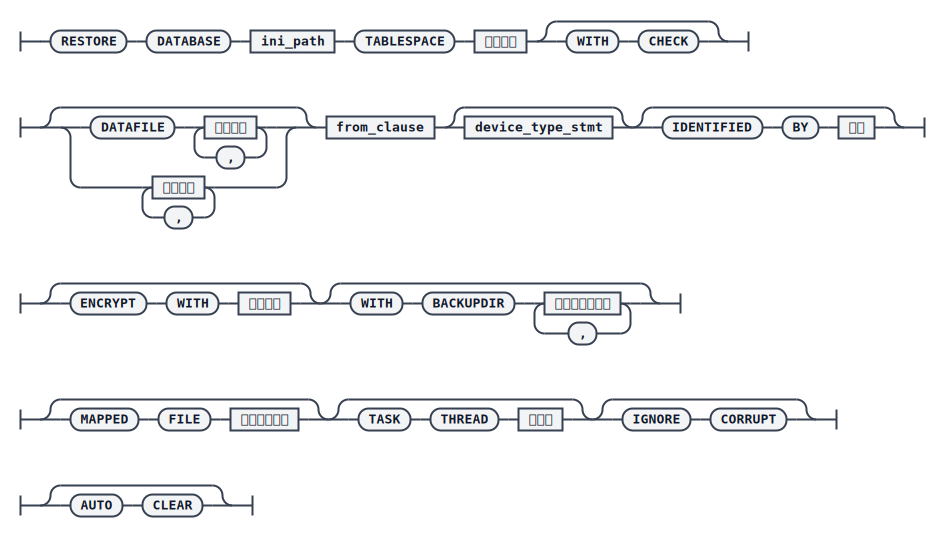

# RESTORE TABLESPACE

`RESTORE` 命令同样可以完成表空间的脱机还原。还原使用的备份集可以是联机或脱机生成的库备份集，也可以是联机生成的表空间备份集。脱机表空间还原仅涉及表空间数据文件的重建与数据页的拷贝，不需要事先将目标表空间置为 `OFFLINE` 状态。

表空间还原后，表空间状态会被置为 `RES_OFFLINE`，并设置数据标记 `FIL_TS_RECV_STATE_RESTORED`，表示已经还原但数据尚不完整，需要进一步执行 [RECOVER TABLESPACE](./recover-tablespace) 才能恢复到一致状态。

## 语法



`<from_clause>`


`<device_type_stmt>`


## 关键参数说明

- `DATABASE`：指定还原目标库的 `dm.ini` 文件路径。
- `TABLESPACE`：指定待还原的表空间，`TEMP` 表空间不支持表空间级还原。
- `WITH CHECK`：还原前先校验备份集数据完整性，缺省不校验。
- `DATAFILE`：仅还原表空间中指定的数据文件，可以用文件编号（对应动态视图 `V$DATAFILE` 中 `ID` 列的值）或文件路径（对应 `V$DATAFILE` 中 `PATH` 或 `MIRROR_PATH` 列的值，也可只写文件名，按 `SYSTEM` 目录补齐路径）指定。
- `BACKUPSET` / `BACKUPNAME`：分别指定用于还原的备份集路径或备份名称。
- `DEVICE TYPE` / `PARMS`：备份集存储的介质类型，支持 `DISK` 和 `TAPE`，默认 `DISK`；`PARMS` 仅 `TAPE` 介质有效。
- `IDENTIFIED BY` / `ENCRYPT WITH`：加密表空间备份还原时使用的解密密码及对应算法，未指定算法时默认 `AES256_CFB`。
- `WITH BACKUPDIR`：用于增量备份还原时指定基备份搜索目录，用法与数据库还原中的同名参数一致。
- `MAPPED FILE`：指定存放还原目标路径的映射文件路径，可重新指定备份集中数据文件还原后的路径。
- `TASK THREAD`：还原过程中数据处理线程的个数，取值范围 0~64，默认 4；指定为 0 调整为 1，超过主机核数时调整为主机核数。
- `IGNORE CORRUPT`：还原时若存在损坏页是否跳过并继续，不指定则默认报错；指定后会在日志中打印警告信息，便于后续用 `DUMP PACKAGE` 命令定位坏页。
- `AUTO CLEAR`：还原时按簇写入数据页并清理簇中的无效页；不指定则默认按连续页写入。

## 示例：常规表空间还原

```plaintext
RMAN>CHECK BACKUPSET '/home/dm_bak/ts_full_bak_for_restore';
RMAN> RESTORE DATABASE '/opt/dmdbms/data/DAMENG_FOR_RESTORE/dm.ini' TABLESPACE MAIN FROM BACKUPSET  '/home/dm_bak/ts_full_bak_for_restore';
```

也可以指定备份名称：

```plaintext
RMAN> RESTORE DATABASE '/opt/dmdbms/data/DAMENG_FOR_RESTORE/dm.ini' TABLESPACE MAIN FROM BACKUPNAME TS_FULL_BAK_01;
```

## 示例：还原表空间中指定的数据文件

通过查询动态视图 `V$DATAFILE` 获取数据文件的编号或路径，再用 `DATAFILE` 子句还原其中的部分文件：

```plaintext
RMAN>RESTORE DATABASE '/home/xm/DAMENG/dm.ini' TABLESPACE TS_FOR_RES_01 DATAFILE 1, 2 FROM BACKUPSET '/home/dm_bak/ts_bak_for_dbf';
```

或者直接指定文件路径：

```plaintext
RMAN>RESTORE DATABASE '/home/xm/DAMENG/dm.ini' TABLESPACE TS_FOR_RES_01 DATAFILE '/home/xm/DAMENG/ts_for_res_01_02.dbf', '/home/xm/DAMENG/ts_for_res_01_03.dbf' FROM BACKUPSET '/home/dm_bak/ts_bak_for_dbf';
```

## 示例：指定映射文件还原

先用 `DUMP BACKUPSET ... MAPPED FILE` 生成映射文件，再在还原时指定该文件以改变数据文件的目标路径：

```plaintext
RMAN>DUMP BACKUPSET '/home/dm_bak/ts_bak_for_map' MAPPED FILE '/home/dm_mappedfile/map_file.txt';
RMAN>RESTORE DATABASE '/home/xm/DAMENG/dm.ini' TABLESPACE MAIN FROM BACKUPSET
'/home/dm_bak/ts_bak_for_map' MAPPED FILE '/home/dm_mappedfile/map_file.txt';
```

## 使用说明

表空间还原不能用于 `TEMP` 表空间，指定数据文件还原也不能指定 `TEMP` 表空间中的文件。表空间还原要求还原目标库与备份库为同一个库；处于 `RES_OFFLINE` 或 `CORRUPT` 状态的表空间不允许只还原其中的部分数据文件；目标库不能是已经执行过 `RESTORE` 但尚未执行 `RECOVER` 的库。

整个还原过程不会修改数据库本身的状态或调整 `CKPT_LSN`；表空间还原要求目标库必须是正常退出的数据库。若 `SYSTEM` 表空间故障，必须优先通过库级还原修复，不支持对其执行表空间级还原；若 `SYSTEM` 表空间处于 `ONLINE`/`OFFLINE` 状态但文件丢失，同样必须通过库还原修复。

在 DMDSC 环境中进行表空间还原，需要先确保所有节点实例都已退出，此时在任一节点上使用该节点的备份集均可完成还原，只需在一个节点上执行即可。
