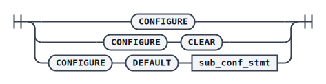
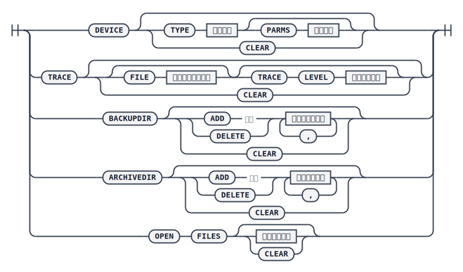

# 配置 dmrman

dmrman 提供 `CONFIGURE` 命令进行默认参数配置，可以配置默认的存储介质类型、跟踪日志文件、备份集搜索目录和归档日志搜索目录。这些默认值在配置之后无需在每次执行备份还原命令时重复指定；如果某条 dmrman 命令中显式指定了相同的参数，则会覆盖 `CONFIGURE` 配置的默认值。设置的参数默认值仅在当前 dmrman 实例存活期间有效，工具退出后即失效。

语法如下：



`<sub_conf_stmt>`



## 示例

查看当前所有配置项的默认值：

```plaintext
RMAN>CONFIGURE;

THE DMRMAN DEFAULT SETTING:

DEFAULT DEVICE:
MEDIA : DISK

DEFAULT TRACE :
FILE :
LEVEL : 1

DEFAULT BACKUP DIRECTORY:
TOTAL COUNT :0

DEFAULT ARCHIVE DIRECTORY:
TOTAL COUNT :0
```

修改默认存储介质类型为第三方介质（`TAPE`）：

```plaintext
RMAN>CONFIGURE DEFAULT DEVICE TYPE TAPE PARMS 'command';
```

配置默认跟踪日志文件路径和级别：

```plaintext
RMAN>CONFIGURE DEFAULT TRACE FILE '/home/dm_trace/trace.log' TRACE LEVEL 2;
```

添加默认备份集搜索目录，用于增量备份还原时自动搜索基备份：

```plaintext
RMAN>CONFIGURE DEFAULT BACKUPDIR ADD '/home/dm_bak1','/home/dm_bak2';
```

添加默认归档日志搜索目录：

```plaintext
RMAN>CONFIGURE DEFAULT ARCHIVEDIR ADD '/home/dm_arch1','/home/dm_arch2';
```

只增加或删除部分搜索目录时，不需要重新配置所有目录，直接添加或删除指定目录即可：

```plaintext
RMAN>CONFIGURE DEFAULT BACKUPDIR ADD '/home/dm_bak3';
RMAN>CONFIGURE DEFAULT BACKUPDIR DELETE '/home/dm_bak3';
```

将所有配置项恢复为默认值：

```plaintext
RMAN>CONFIGURE CLEAR;
```
